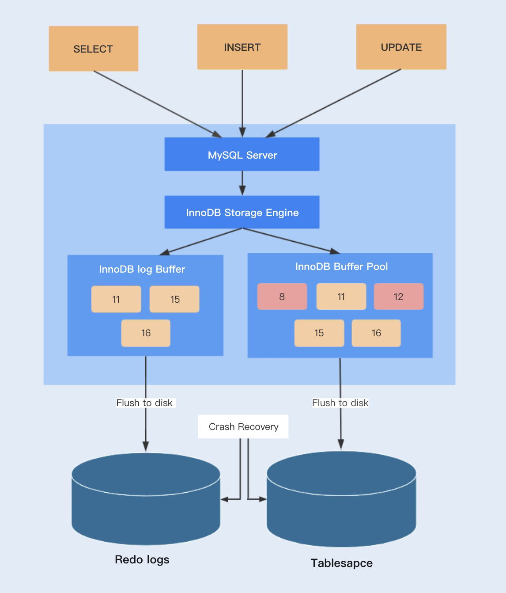

## MySQL 四种事务隔离级别（ACID）

- 原子性（A）：事务开始后所有操作，要么全部做完，要么全部不做，不可能停滞在某个中间环节。

- 一致性（C）：事务开始前后，数据库的完整性约束没有被破坏。

- 隔离性（I）：同一时间内，多个事务并行时，只允许一个事务请求同一数据，不同的事务之间批次没有任何干扰。

- 持久性（D）：事务完成后，事务对数据库的所有更新将被保存到数据库中，不能回滚。


## MySQL 怎么保证一致性的？

先从数据库层面分析，数据库通过原子性、隔离性、持久性来保证一致性。也就是说 ACID 四大特性中，C（一致性）是目的，A（原子性）、I（隔离性）、D（持久性）是手段，是为了保证一致性而提供的手段。数据库必须要实现 AID 三大特性才有可能实现一致性。例如：原子性无法保证，显然一致性也无法保证。

但是，如果你在事务里故意编写出违反约束的代码，一致性还是无法保证的。例如，你在转账的例子中，你的代码里故意不给 B 账户加钱，那一致性还是无法保证。因此，还必须从应用层角度考虑。

从应用层面，通过代码判断数据库数据是否有效，然后决定回滚还是提交数据。


## MySQL 怎么保证原子性的？

MySQL 利用 InnoDB 的 undo log 来保证原子性的。undo log（回滚日志）是实现原子性的关键，当事务回滚时能够撤销所有已经成功执行的 SQL 语句，他需要记录你要回滚的相应日志信息。

例如：

- 当你 delete 一条数据的时候，就需要记录这条数据的信息，回滚的时候，insert 这条旧数据；
- 当你 update 一条数据的时候，就需要记录这条数据的旧值，回滚的时候，根据旧值执行 update 操作；
- 当你 insert 一条数据的时候，就需要记录这条新纪录的主键，回滚的时候，根据主键执行 delete 操作。

undo log 记录了这些回滚需要的信息，当事务执行失败或调用 rollback，导致事务需要回滚，便可以李涌 undo log 中的信息将数据回滚到修改之前的样子。


## MySQL 怎么保证持久性的？

MySQL 利用 InnoDB 得 redo log 来保证持久性的。我们直到 MySQL 是先把磁盘上的数据加载到内存中，在内存中对数据进行修改，再刷回磁盘上。但如此此时突然宕机，内存中的数据就会丢失。为了解决这个问题我们可以在事务提交前就直接把数据写入磁盘，但是这又会引发另一个问题。我们只修改一个页面里的一个字节，就要将整个页面刷入磁盘，这样很浪费资源。毕竟一个页面 16KB 大小，只改其中一点点内容，就要将 16 KB的内容刷入磁盘，显然不是很合理。况且一个事务里的 SQL 可能牵涉到多个数据页的修改，而这些数据页可能不是相邻的，也就是属于随机 IO。显然操作随机 IO，速度会比较慢。

于是，MySQL 决定采用 redo log 来解决上面的问题。当数据修改的时候，不仅在内存中操作，还会再 redo log 中个记录这次操作。当事务提交的时候，会将 redo log 日志进行刷盘（redo log 一部分在内存中，一部分在磁盘上）。当数据库宕机重启的时候，会将 redo log 中的内容恢复到数据库中，再根据 redo log 和 bin log 内容决定是回滚数据库还是提交数据。


## redo log 工作原理

**InnoDB 是一个事务性的存储引擎，而 InnoDB 的事务实现是基于事务日志 redo log 和 undo log 实现的。**

**redo log 是重做日志，提供再写入操作，实现事务的持久性；undo log 是回滚日志，提供回滚操作，保证事务的一致性。**

redo log 又包括了内存中的日志缓冲（redo log buffer）以及保存再磁盘的重做日志文件（redo log file），前者存储在内存中，容易丢失，后者持久化在磁盘中，不会丢失。

InnoDB 的更新操作采用的是 Write Ahead Log 策略，即先写日志，再写入磁盘。当一条记录更新时，InnoDB 会先把记录写入到 redo log buffer 中，并更新内存数据。可以通过参数 innodb_flush_log_at_trx_commit 自定义 commit 时，如何将 redo log buffer 中的日志刷新到 redo log file 中。

在这里，需要注意的是 InnoDB 的 redo log 的大小是固定的，分别有多个日志文件采用循环方式组成一个循环闭环，当写到结尾时，会回到开头循环写日志。可以通过参数 innodb_log_files_in_group 和 innodb_log_file_size 配置日志文件数量和每个日志文件的大小。

**Buffer Poll 中更新的数据未刷新到磁盘中，该内存页称之为脏页。**最终脏页的数据会刷新到磁盘中，将磁盘中的数据覆盖，这个过程与 redo log 不一定有关系。

只有当 redo log 日志满了的情况下，才会主动触发脏页刷新到磁盘，而脏页不仅只有 redo log 日志满了的情况才会刷新到磁盘，以下几种情况同样会触发脏页的刷新：

- 系统内存不足时，需要将一部分数据页淘汰掉，如果淘汰的是脏页，需要先将脏页同步到磁盘；
- MySQL 认为空间的时间，这种情况没有性能开销；
- MySQL 正常关闭之前，会把所有的脏页刷入到磁盘，这种情况也没有性能问题。

在生产环境中，如果开启了慢 SQL 监控，会发现偶尔出现一些用时稍长的 SQL。这是因为脏页在刷新到磁盘时可能会给数据库带来性能开销，导致数据库操作抖动。



## 脏读、不可重复读、幻读

- 脏读

  事务 B 读取了事务 A 未提交的更新数据；此时如果 A 事务回滚，那么 B 事务读取的数据就是脏数据。

- 不可重复读

  事务 B 两次读取同一数据，其中在第一次读取后，事务 A 对该数据进行了更新，事务 B 第二次读取数据后，就会发现与第一次的数据存在差异，这就是不可重复读。不可重复读有一种特俗情况，两个事务更新同一条数据时，后完成的事务会覆盖先完成的事务更新的数据，这就造成了先完成事务的更新丢失，这种情况就叫做**第二类丢失更新**。但目前主流的数据库已经默认屏蔽了第一类丢失更新问题，（即：后做的事务撤销，发生回滚造成已完成事务的更新丢失），但我们编程的时候仍需要特别注意第二类丢失更新。

- 幻读

  幻读与不可重复读类似；B 事务读取了两次数据，在读取第一次数据之后，A 事务进行数据的**新增**或**删除**，B 事务第二次读取的时候，就会发现数据变多或变少了，这就是幻读。幻读与不可重复读的侧重点不一样，前者是数据的新增删除造成，后者是数据的更新造成。


## 乐观锁与悲观锁

### 乐观锁

每次去拿数据的时候都认为别人不会修改，所以不会上锁，但是如果想要更新数据，则会在更新前检查在读取至更新这段时间有没有其它线程修改过这个数据。如果修改过，则重新读取，再次尝试更新，循环上述的步骤直到更新成功，。乐观锁适用于多读的应用类型，这样可以提高吞吐量。相对于悲观锁，在对数据库进行处理的时候，乐观锁并不会使用数据库提供的锁机制。一般的实现乐观锁的方式就是记录数据版本或者是时间戳来实现，使用版本记录是最常用的。

### 悲观锁

每次去拿数据的时候都认为别人会修改。所以每次在拿数据的时候都会上锁。这样别人想拿数据就被挡住，直到悲观锁释放。悲观锁中的共享资源每次都只会给一个线程使用，其它线程阻塞，直到用完释放锁后其它线程才能使用。数据库中的行锁、表锁、读锁（共享锁）、写锁（排它锁），以及 syncronized 实现的锁均为悲观锁，悲观锁并发控制采用“先取锁再访问”的保守策略。


## 三大范式

**第一范式**：字段具有原子性，不可再分（字段单一职责）

**第二范式**：满足第一范式，每行应该被唯一区分，加一列存放每行的唯一标识符，称为主键（都要依赖主键）

**第三范式**：满足第一、第二范式，且一个表不能包含其它表已存在的非主键信息（不间接依赖，不存在其它表的非主键信息）

**范式优点与缺点**

优点：范式化，重复冗余数据少，更新快，修改少，查询时更少的 distinct。

缺点：因为一个表不存在冗余重复数据，**查询可能会造成很多关联**，效率变低，**可能使一些索引策略无效**，范式化将列存在不同的表中，这些列若能在同一个表中可以是一个索引。


## InnoDB 与 MyISAM 的区别

### MyISAM 与 InnoDB 的区别

- InnoDB 是聚簇索引，MyISAM 是非聚簇索引
- InnoDB 数据与索引一起保存在 `.ibd` 中，MyISAM 表结构存储在 `.frm`，索引存在 `.myi`，数据存在 `.myd` 
- InnoDB 支持事务、外键、行锁和表锁，MyISAM 不支持事务、外键，只支持表锁
- InnoDB 更新更优，MyISAM 查询更优
- 索引都是采用的 B+Tree 索引
- MyISAM 支持全文索引，InnoDB 5.6 版本以前不支持，之后的版本才开始支持全文索引

### MyISAM

- 支持事务，但是每次查询都是原子的
- 支持表级锁，每次操作会对整张表加锁
- 存储表的总行数
- 一个 MyISAM 表由三个文件组成，表结构 `.frm`、索引 `.myi`、数据 `.myd`
- 采用非聚簇索引，索引文件的数据域存储指向数据文件的指针。辅索引与主索引基本一致，但是辅索引不用保证唯一性。

### InnoDB

- 支持 ACID 事务，支持四种隔离级别
- 支持行级锁及外键约束，因此支持写并发
- 不存储总行数
- 主键索引采用聚簇索引（索引的数据域存储数据文件本身），辅索引的数据域存储主键的值；因此从辅索引查询数据，需要先通过辅索引得到数据主键，再访问主索引（回表），最好使用自增主键，防止插入数据时，为维持 B+Tree 树结构时，文件的大调整。

### 使用场景

大多数时候我们使用的都是 InnoDB 存储引擎，在某些读密集的情况下，使用 MyISAM 也是合适的（不过，前提是你的项目不介意这样）。

MyISAM 不支持事务、崩溃恢复等缺点（这些都是比较敏感缺陷）。

- MyISAM 适合读多更新少的：MyISAM 索引与数据是分开放的，因此有读取快的说法。
- InnoDB 适合插入更新频繁的：索引与数据一起放，建立索引更复杂，使用行锁，对于频繁更新操作效率更高。

**总结**：MyISAM 查询更优，InnoDB 更新更优。

**MyISAM 适合读多，更新少的场景**。MyISAM 使用非聚簇索引，数据和索引分开存的，而 InnoDB 数据和索引存在一起；数据量大时，一个内存页大小固定，读进内存的数据 MyISAM 就多一点（数据量小看不出差距，数据量大时差距就明显了）。因为 MyISAM 只把索引指针读进内存，可以存更多索引，所以查询速度也就更快，而 InnoDB 还需要维护其它数据，比如其它的隐藏字段 row_id、tx_id 等。


## 自增主键的理解

### 自增主键

InnoDB 引擎的自增值，其实是**保存在内存中**的，并且到了 MySQl 8.0 版本以后，才有了**“自增持久化”**的能力，也就是才实现了**“如果发生了重启，表的自增值可以恢复为 MySQL 重启前的值”**。

- 在 MySQL 5.7 及以前的版本，**自增值保存在内存里**，并没有持久化。每次重启后，第一次打开表的时候，都会去查找**自增值的最大值**。max(id)，然后将 max(id) + 1 作为这个表当前的自增值。

  ::: tip

  举例来说，如果一个表当前数据行里最大的id是10，AUTO_INCREMENT=11。这时候，我们删除id=10的行，AUTO_INCREMENT还是11。但如果马上重启实例，重启后这个表的AUTO_INCREMENT就会变成10。也就是说，MySQL重启可能会修改一个表的AUTO_INCREMENT的值。

  :::

- 在 MySQL 8.0 版本，将自增值的变更记录在了 redo log 中，重启的时候依靠 redo log 恢复重启前的值。

### 自增值修改机制

- 如果插入数据时 id 字段指定为 0、null 或未指定值，那么就把这个表当前的 AUTO_INCREMENT 值填到自增字段。
- 如果插入数据时 id 字段指定了具体的值，就直接使用语句里指定的值。

### 自增值新增机制

- 如果准备插入的值 >= 当前自增值，新的自增值就是 **“准备插入的值 + 1”**；
- 否则，自增值不变。


## 为什么自增主键不连续

- 在 MySQL 5.7 及之前的版本，自增值保存在内存里，没有持久化

- **「事务回滚」**（自增值不能回滚，因为并发插入数据时，回退自增值 ID 可能会造成主键冲突）

- 唯一键冲突（由于表的自增值已变，但是主键发生冲突没有插入数据，下一次插入主键=现在变了的自增值 + 1，所以不连续）

  ::: tip

  假设，表t里面已经有了(1,1,1)这条记录，这时我再执行一条插入数据命令：

  ``` sql
  insert into t values(null, 1, 1); (自增id,唯一键c,普通字段d)
  ```

  这个语句的执行流程就是：

  1. 执行器调用InnoDB引擎接口写入一行，传入的这一行的值是(0,1,1);
  2. InnoDB发现用户没有指定自增id的值，获取表t当前的自增值2；
  3. 将传入的行的值改成(2,1,1);
  4. 将表的自增值改成3；
  5. 继续执行插入数据操作，由于已经存在c=1的记录，所以报Duplicate key error，语句返回。

  这个表的自增值改成3，是在真正执行插入数据的操作之前。这个语句真正执行的时候，因为碰到唯一键c冲突，所以id=2这一行并没有插入成功，但也没有将自增值再改回去。

  所以，在这之后，再插入新的数据行时，拿到的自增id就是3。**「也就是说，出现了自增主键不连续的情况」**。

  :::


## InnoDB 为什么推荐用自增ID

- 主键页就会近乎于顺序的记录填满，提升了页面的最大填充率，不会有页的浪费

- 新插入的行一定会在原有的最大数据行下一行，MySQL 定位和寻址很快，不会为计算新行的位置而做出额外的消费

- 减少了页分裂和碎片的产生

  **「UUID」**：**「大量的随机IO」**+**「页分裂导致移动大量的数据」**+ 数据会有碎片

**总结**：自增 ID 有序，会按照顺序往最后插入，而 UUID 无序，随机生成，随机插入，会造成频繁的页分裂，内存碎片化，产生大量的随机 IO。


## 什么是索引

- 排好序的数据结构，可以帮助快速查找数据
- 优缺点：索引可以提高查询速度，查询使用优化隐藏器提高性能，但是也会占据物理空间，降低增删改的速度，因为还要操作索引文件。

### 索引类型（覆盖索引 + 回表 + 索引下推 + 联合索引）

**「普通索引」**：可以重复

**「唯一索引」**：唯一，可为空，表中只有一个主键索引，可有多个唯一索引

**「主键索引」**

- 唯一，不为空，叶子节点存储行数据记录，主键索引也称为聚簇索引，对应非主键索引的叶子节点存的主键的值（二级索引），用二级索引查需要回表操作（根据二级索引查到主键，再根据主键去主键索引查询）。
- 一般推荐用自增主键，**保证空间利用率，减少页分裂**。

**「全文索引」**

----

**「覆盖索引」**：索引字段覆盖了查询语句涉及的字段，直接通过索引文件就可以返回查询所需的数据，不必通过回表操作。

**「回表」**：通过索引找到主键，再根据主键 ID 去查询所需数据。

**「索引下推」**：在根据索引查询过程中就根据查询条件过滤掉一些记录，减少最后的回表操作。

**「联合索引」**：组合索引（最左前缀原则）


## 索引底层数据结构


## 什么是 B 树？

B 树（Balance Tree）和 B+ 树都可以认为是 m 叉的多路平衡树查找树，但是从理论上讲，二叉树查找速度和比较次数都是最小的，那为什么在数据库索引应用中不采用二叉树呢？

因为我们需要考虑到磁盘 IO 的影响，它相对于内存来说是很慢的。数据库索引是存储在磁盘上的，当数据量大时，就不能把整个索引全部加载到内存中，只能逐一加载每一个磁盘页（对应索引树的节点）。所以我们要减少 IO 次数，对于树来说，IO 次数就是树的高度，而”胖矮“就是 B树的特征之一，它的每个节点最多包含 m 个孩子，m 称为 b 树的阶，m 的大小取决于磁盘页的大小。

- 一个 m 阶的 B 树具有如下几个特征：
  - 定义任意非叶子结点最多只有M个儿子，且M>2；
  - 根结点的儿子数为[2, M]；
  - 除根结点以外的非叶子结点的儿子数为[M/2, M]，向上取整；
  - 非叶子结点的关键字个数=儿子数-1；
  - 所有叶子结点位于同一层；
  - k个关键字把节点拆成k+1段，分别指向k+1个儿子，同时满足查找树的大小关系。

- B 树的一些特征
  - 关键字集合分布在整颗树中；
  - 任何一个关键字出现且只出现在一个结点中；
  - 搜索有可能在非叶子结点结束；
  - 其搜索性能等价于在关键字全集内做一次二分查找。


## 什么是 B+ 树？

B+树，是 B树 的一种变体，查询性能更好。m阶的 B+ 树的特征：

- 有 n棵子树的非叶子结点中含有 n 个关键字（B树 是 n-1 个），这些关键字不保存数据，只用来索引，所有数据都保存在叶子节点（B树是每个关键字都保存数据）。
- 所有的叶子结点中包含了全部关键字的信息，及指向含这些关键字记录的指针，且叶子结点本身依靠关键字的大小自小而大顺序连接。
- 所有的非叶子结点可以看成是索引部分，结点中仅含其子树中的最大（或最小）关键字。
- 通常在 B+ 树上有两个头指针，一个指向根结点，一个指向关键字最小的叶子结点。
- 同一个数字会在不同节点中重复出现，根节点的最大元素就是 B+ 树的最大元素。


## B+ 树相比于 B 树的查询优势

- B+ 树的中间节点不存储数据，所以磁盘页能容纳更多的节点元素，更”胖矮“；
- B+ 树查询必须查找到叶子节点，B 树只要匹配到即可不用管元素位置，因此 B+ 树查找更稳定（稳定不代表慢）；
- 对于范围查询来说，B+ 树只需要遍历叶子节点链表即可，B树却需要重复地中序遍历。


## 索引的设计原则（查询快，占用空间少）

- 出现在 where 子句或则连接子句中的字段可作为索引字段
- 基数小的表没必要建立索引
- 使用短索引，如果索引
