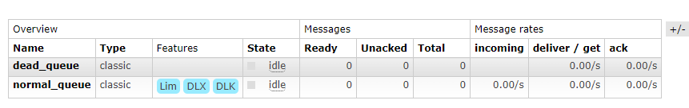

死信在 RabbitMQ 中指无法被正常消费的消息。通常情况下，生产者将消息投递到 Broker 或是消息队列中，消费者直接从消息队列中取出消息进行消费即可，但由于某些特殊原因导致了消息队列中的某些消息无法被消费，这样的消息如果没有后续的处理，就变成了死信，有死信自然就有了死信队列。

应用场景：为了保证订单业务的消息数据不丢失，就可以使用 RabbitMQ 的死信队列机制，当消息消费发生异常时，将消息投入死信队列中。还有一种场景，用户在商城下单成功并点击去支付后在指定时间未支付时自动失效。

## 死信的来源

* 消息 TTL 过期
* 队列达到最大长度（队列满了，无法再添加数据到指定的队列中）
* 消息被拒绝（basic.reject 或 basic.nack）并且 requeue = false

## 代码演示

### 程序架构图


### 消息 TTL 过期

#### 生产者

```java
public class Product {

    private static final String NORMAL_EXCHANGE = "normal_exchange";

    public static void main(String[] args) {
        try (Channel channel = RabbitMqUtils.getChannel()) {
            channel.exchangeDeclare(NORMAL_EXCHANGE, BuiltinExchangeType.DIRECT);
            // 设置消息的 TTL 时间
            AMQP.BasicProperties basicProperties = new AMQP.BasicProperties().builder().expiration("10000").build();
            for (int i = 0; i < 100; i++) {
                String msg = "消息" + i;
                channel.basicPublish(NORMAL_EXCHANGE, "normal", basicProperties, msg.getBytes(StandardCharsets.UTF_8));
                System.out.println("生产者发送消息：" + msg);
            }
        } catch (IOException | TimeoutException e) {
            e.printStackTrace();
        }
    }
}
```

#### 正常消费者

```java
public class ConsumerA {

    private static final String NORMAL_EXCHANGE = "normal_exchange";

    private static final String DEAD_EXCHANGE = "dead_exchange";

    public static void main(String[] args) throws IOException, TimeoutException {

        Channel channel = RabbitMqUtils.getChannel();
        channel.exchangeDeclare(NORMAL_EXCHANGE, BuiltinExchangeType.DIRECT);
        channel.exchangeDeclare(DEAD_EXCHANGE, BuiltinExchangeType.DIRECT);

        // 声明死信队列
        String deadQueue = "dead_queue";
        channel.queueDeclare(deadQueue, false, false, false, null);
        // 死信队列绑定死信交换机与 routingKey
        channel.queueBind(deadQueue, DEAD_EXCHANGE, "dead");

        // 正常队列绑定死信队列信息
        Map<String, Object> param = new HashMap<>();
        // 正常队列设置死信交换机 参数 key 是固定值
        param.put("x-dead-letter-exchange", DEAD_EXCHANGE);
        // 正常队列设置死信 routing-key 参数 key 是固定值
        param.put("x-dead-letter-routing-key", "dead");

        String normalQueue = "normal_queue";
        channel.queueDeclare(normalQueue, false, false, false, param);
        channel.queueBind(normalQueue, NORMAL_EXCHANGE, "normal");

        System.out.println("等待接收消息........... ");
        DeliverCallback deliverCallback = (consumerTag, delivery) -> {
            String message = new String(delivery.getBody(), StandardCharsets.UTF_8);
            System.out.println("ConsumerA 接收到消息" + message);
        };
        channel.basicConsume(normalQueue, true, deliverCallback, consumerTag -> {
        });

    }
}
```

#### 死信消费者

```java
public class ConsumerB {

    private static final String DEAD_EXCHANGE = "dead_exchange";

    public static void main(String[] args) throws IOException, TimeoutException {
        Channel channel = RabbitMqUtils.getChannel();
        channel.exchangeDeclare(DEAD_EXCHANGE, BuiltinExchangeType.DIRECT);
        String deadQueue = "dead_queue";
        channel.queueDeclare(deadQueue, false, false, false, null);
        channel.queueBind(deadQueue, DEAD_EXCHANGE, "dead");
        System.out.println("等待接收死信队列消息........... ");
        DeliverCallback deliverCallback = (consumerTag, delivery) -> {
            String message = new String(delivery.getBody(), StandardCharsets.UTF_8);
            System.out.println("ConsumerB 接收死信队列的消息:" + message);
        };
        channel.basicConsume(deadQueue, true, deliverCallback, consumerTag -> {
        });

    }
}
```

先启动正常消息消费者，查看RabbitMQ 管理后台：


关停消费者程序，模拟正常消费者出现异常，无法正常消费，然后启动消息生产者，向队列中投递了 100 条消息：


当等待 10 秒钟过后，正常队列中的消息过期，消息将转移到死信队列中：


启动死信消费者，可以在控制台看到死信队列中消息被消费。

### 队列达到最大长度

#### 生产者

```java
public class Product {

    private static final String NORMAL_EXCHANGE = "normal_exchange";

    public static void main(String[] args) {
        try (Channel channel = RabbitMqUtils.getChannel()) {
            channel.exchangeDeclare(NORMAL_EXCHANGE, BuiltinExchangeType.DIRECT);
            for (int i = 0; i < 100; i++) {
                String msg = "消息" + i;
                channel.basicPublish(NORMAL_EXCHANGE, "normal", null, msg.getBytes(StandardCharsets.UTF_8));
                System.out.println("生产者发送消息：" + msg);
            }
        } catch (IOException | TimeoutException e) {
            e.printStackTrace();
        }
    }
}
```

#### 正常消费者

```java
public class ConsumerA {

    private static final String NORMAL_EXCHANGE = "normal_exchange";

    private static final String DEAD_EXCHANGE = "dead_exchange";

    public static void main(String[] args) throws IOException, TimeoutException {

        Channel channel = RabbitMqUtils.getChannel();
        channel.exchangeDeclare(NORMAL_EXCHANGE, BuiltinExchangeType.DIRECT);
        channel.exchangeDeclare(DEAD_EXCHANGE, BuiltinExchangeType.DIRECT);

        // 声明死信队列
        String deadQueue = "dead_queue";
        channel.queueDeclare(deadQueue, false, false, false, null);
        // 死信队列绑定死信交换机与 routingKey
        channel.queueBind(deadQueue, DEAD_EXCHANGE, "dead");

        // 正常队列绑定死信队列信息
        Map<String, Object> param = new HashMap<>();
        // 正常队列设置死信交换机 参数 key 是固定值
        param.put("x-dead-letter-exchange", DEAD_EXCHANGE);
        // 正常队列设置死信 routing-key 参数 key 是固定值
        param.put("x-dead-letter-routing-key", "dead");
        // 设置正常队列长度的限制
        param.put("x-max-length", 50);

        String normalQueue = "normal_queue";
        channel.queueDeclare(normalQueue, false, false, false, param);
        channel.queueBind(normalQueue, NORMAL_EXCHANGE, "normal");

        System.out.println("等待接收消息........... ");
        DeliverCallback deliverCallback = (consumerTag, delivery) -> {
            String message = new String(delivery.getBody(), StandardCharsets.UTF_8);
            System.out.println("ConsumerA 接收到消息" + message);
        };
        channel.basicConsume(normalQueue, true, deliverCallback, consumerTag -> {
        });

    }
}
```

#### 死信消费者

与上案例一致

这里修改了队列的配置，正常消费者添加了 `x-max-length`  配置，限制其队列大小，所以启动这个消费者前需要先将之前的队列删除，当然也可以选择创建一个新队列。启动正常消费者后：



关停正常消费者，启动生产者；生产者投递了 100 条消息，由于 normal\_queue 的容量只有 50，另外多出来的 50 条消息将投递到死信队列中：


再次启动正常消费者和死信消费者，就可以在控制台看到两个消费的输出。

### 消息拒绝

#### 生产者

与上个案例一致

#### 正常消费者

```java
public class ConsumerA {

    private static final String NORMAL_EXCHANGE = "normal_exchange";

    private static final String DEAD_EXCHANGE = "dead_exchange";

    public static void main(String[] args) throws IOException, TimeoutException {

        Channel channel = RabbitMqUtils.getChannel();
        channel.exchangeDeclare(NORMAL_EXCHANGE, BuiltinExchangeType.DIRECT);
        channel.exchangeDeclare(DEAD_EXCHANGE, BuiltinExchangeType.DIRECT);

        // 声明死信队列
        String deadQueue = "dead_queue";
        channel.queueDeclare(deadQueue, false, false, false, null);
        // 死信队列绑定死信交换机与 routingKey
        channel.queueBind(deadQueue, DEAD_EXCHANGE, "dead");

        // 正常队列绑定死信队列信息
        Map<String, Object> param = new HashMap<>();
        // 正常队列设置死信交换机 参数 key 是固定值
        param.put("x-dead-letter-exchange", DEAD_EXCHANGE);
        // 正常队列设置死信 routing-key 参数 key 是固定值
        param.put("x-dead-letter-routing-key", "dead");
        // 设置正常队列长度的限制
        // param.put("x-max-length", 50);

        String normalQueue = "normal_queue";
        channel.queueDeclare(normalQueue, false, false, false, param);
        channel.queueBind(normalQueue, NORMAL_EXCHANGE, "normal");

        System.out.println("等待接收消息........... ");
        DeliverCallback deliverCallback = (consumerTag, delivery) -> {
            String message = new String(delivery.getBody(), StandardCharsets.UTF_8);
            if (message.equals("消息5")) {
                System.out.println("ConsumerA 接收到消息" + message + " 并拒绝该消息");
                channel.basicReject(delivery.getEnvelope().getDeliveryTag(), false);
            } else {
                System.out.println("ConsumerA 接收到消息" + message);
                channel.basicAck(delivery.getEnvelope().getDeliveryTag(), false);
            }
        };
        channel.basicConsume(normalQueue, false, deliverCallback, consumerTag -> {
        });

    }
}
```

#### 死信消费者

与上个案例一致

启动消息生产者：


