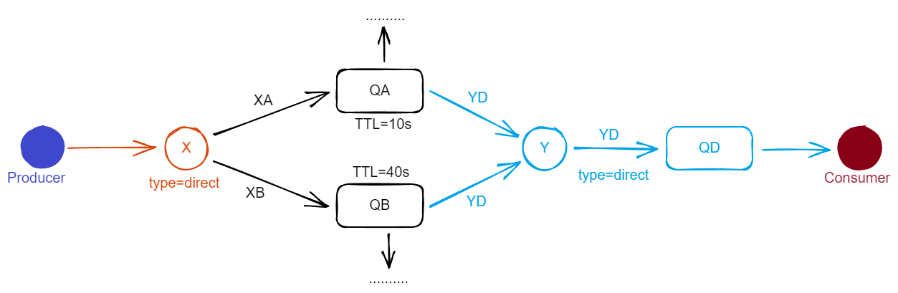
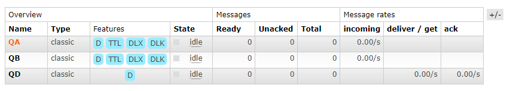
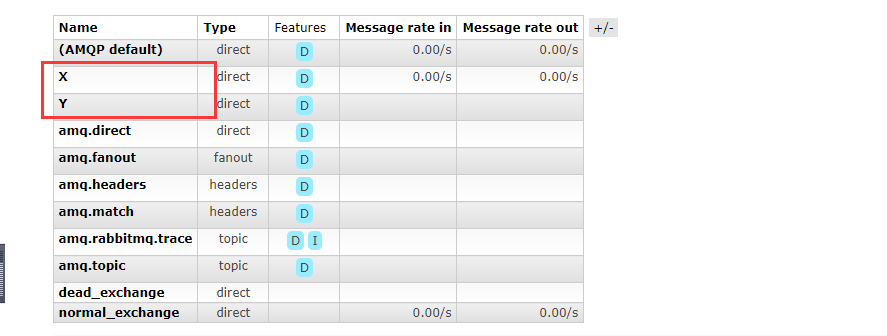
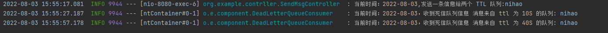
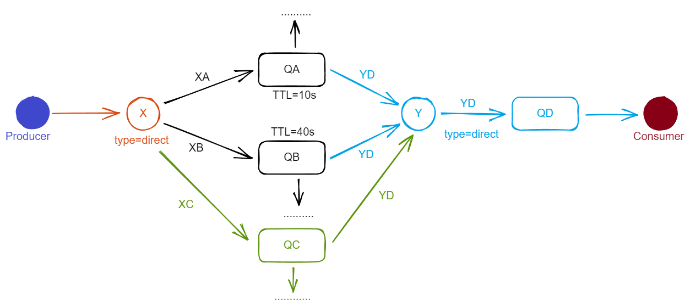
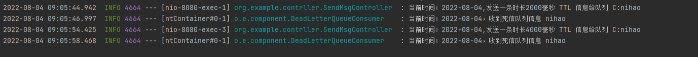
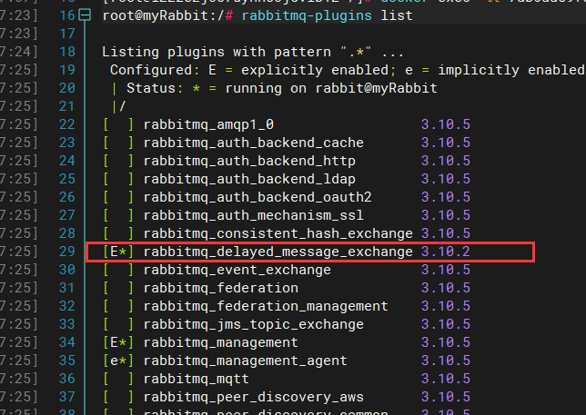
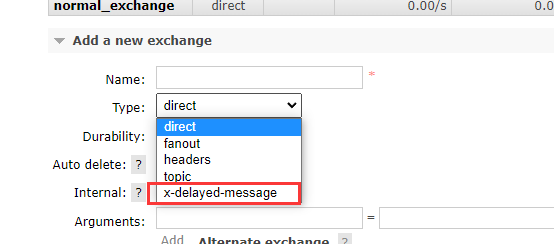
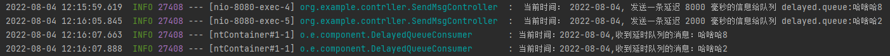

延迟队列，队列的内部是有序的，最重要的特性就是体现在它的延时属性上，延迟队列中的元素是希望`在指定时间到了以后或之前取出和处理` ，简单来说，延时队列就是用来存放需要在指定时间内被处理的元素的队列。

## 延迟队列使用场景

* 订单在十分钟之内未支付则自动取消
* 新创建的店铺，如果在十天内都没有上传过商品，则自动发送消息提醒
* 新用户注册成功后，如果三天内没有登录则进行短信提醒
* 用户发起退款，如果三天内没有得到处理则通知相关运营人员
* 预定会议后，需要在预定的时间点前 10 分钟通知各个参会人员参加会议

这些场景都有一个特点，需要在某个事件发生之后或者之前的指定时间点完成某一项任务，如：发生订单生成时间，在十分钟之后检查该订单支付状态，然后将未支付的订单进行关闭；看起来使用了定时任务，一致轮询数据，每秒查一次，取出需要被处理的数据，然后处理不就完事了吗？如果数据量比较少，确实可以这么做，比如：对于“如果账单一周内未支付则进行自动结算”这样的需求， 如果对于时间不是严格限制，而是宽松意义上的一周，那么每天晚上跑个定时任务检查一下所有未支付的账单，确实也是一个可行的方案。但对于数据量比较大，并且时效性较强的场景，如：“订单十分钟内未支付则关闭”，短期内未支付的订单数据可能会有很多，活动期间甚至会达到百万甚至千万级别，对这么庞大的数据量仍旧使用轮询的方式显然是不可取的，很可能在一秒内无法完成所有订单的检查，同时会给数据库带来很大压力，无法满足业务要求而且性能低下。

## RabbitMQ 中的 TTL

TTL 是什么呢？TTL 是 RabbitMQ 中一个消息或者队列的属性，表明一条消息或者该队列中所有的消息的最大存活时间。单位是毫秒。换句话说，如果一条消息设置了 TTL 属性或进入了设置 TTL 属性的队列，那么这条消息如果在 TTL 设置的时间内没有被消费，则会成为”死信“。如果同时配置了队列的 TTL 和消息的 TTL，那么较小的那个值将会被使用。

* 消息 TTL
* 队列 TTL

## 两中 TTL 配置的区别

如果设置了队列的 TTL 属性，那么一旦消息过期，就会被队列丢弃（如果配置了死信队列会被丢到死信队列中），而第二种方式，消息即使过期，也不一定会被马上丢弃，因为`消息是否过期是在即将投递到消费者之前判定的`，如果当前队列有严重的消息积压情况，则已过期的消息也许还能存活较长时间；另外，还需要注意的一点是，如果不设置 TTL，表示消息永远不会过期，如果将 TTL 设置为 0，则表示除非此时可以直接投递该消息到消费者，否则该消息将会被丢弃。

## 代码演示




创建 SpringBoot 项目，创建配置文件：

### application.yml

```yaml
server:
  port: 8080

spring:
  application:
    name: Rabbit-demo
  rabbitmq:
    host: 23.5.14.214
    port: 5672
    username: test
    password: test
    virtual-host: my_vhost
```

### 配置类 TtlQueueConfig

```java
import org.springframework.amqp.core.*;
import org.springframework.beans.factory.annotation.Qualifier;
import org.springframework.context.annotation.Bean;
import org.springframework.context.annotation.Configuration;

import java.util.HashMap;
import java.util.Map;

@Configuration
public class TtlQueueConfig {

    public static final String X_EXCHANGE = "X";
    public static final String QUEUE_A = "QA";
    public static final String QUEUE_B = "QB";

    public static final String Y_DEAD_LETTER_EXCHANGE = "Y";
    public static final String DEAD_LETTER_QUEUE = "QD";


    /**
     * 声明交换机 xExchange
     */
    @Bean("xExchange")
    public DirectExchange xExchange() {
        return new DirectExchange(X_EXCHANGE);
    }

    /**
     * 声明死信交换机 yExchange
     */
    @Bean("yExchange")
    public DirectExchange yExchange() {
        return new DirectExchange(Y_DEAD_LETTER_EXCHANGE);
    }

    /**
     * 声明队列 A TTL 为 10s，并绑定到对应的死信队列
     */
    @Bean("queueA")
    public Queue queueA() {
        Map<String, Object> args = new HashMap<>(3);
        // 声明当前队列绑定的死信队列
        args.put("x-dead-letter-exchange", Y_DEAD_LETTER_EXCHANGE);
        // 声明当前队列的死信路由 key
        args.put("x-dead-letter-routing-key", "YD");
        // 队列的 TTL
        args.put("x-message-ttl", 10 * 1000);
        return QueueBuilder.durable(QUEUE_A).withArguments(args).build();
    }

    /**
     * 队列 A 绑定绑定交换机 X
     */
    @Bean
    public Binding queueABindingX(@Qualifier("queueA") Queue queue, @Qualifier("xExchange") DirectExchange xExchange) {
        return BindingBuilder.bind(queue).to(xExchange).with("XA");
    }

    /**
     * 声明队列 B TTL 为 40s 并绑定到对应的死信交换机
     */
    @Bean("queueB")
    public Queue queueB() {
        Map<String, Object> args = new HashMap<>(3);
        // 声明当前队列绑定的死信交换机
        args.put("x-dead-letter-exchange", Y_DEAD_LETTER_EXCHANGE);
        // 声明当前队列的死信路由 key
        args.put("x-dead-letter-routing-key", "YD");
        // 声明队列的 TTL
        args.put("x-message-ttl", 40 * 1000);

        return QueueBuilder.durable(QUEUE_B).withArguments(args).build();
    }

    /**
     * 队列 B 绑定绑定交换机 X
     */
    @Bean
    public Binding queueNBindingX(@Qualifier("queueB") Queue queue, @Qualifier("xExchange") DirectExchange xExchange) {
        return BindingBuilder.bind(queue).to(xExchange).with("XB");
    }

    /**
     * 声明死信队列 QD
     */
    @Bean("queueD")
    public Queue queueD() {
        return new Queue(DEAD_LETTER_QUEUE);
    }

    /**
     * 声明死信队列 QD
     *
     * @param queueD    死信队列
     * @param yExchange 死信交换机
     */
    @Bean
    public Binding queueBindingX(@Qualifier("queueD") Queue queueD, @Qualifier("yExchange") DirectExchange yExchange) {
        return BindingBuilder.bind(queueD).to(yExchange).with("YD");
    }

}

```

### 死信队列 DeadLetterQueueConsumer

```java
@Slf4j
@Component
public class DeadLetterQueueConsumer {

    @RabbitListener(queues = "QD")
    public void receiveD(Message message, Channel channel) {
        String msg = new String(message.getBody());
        log.info("当前时间：{}，收到死信队列信息 {}", LocalDate.now(), msg);
    }
}
```

### Controller

```java
import lombok.extern.slf4j.Slf4j;
import org.springframework.amqp.rabbit.core.RabbitTemplate;
import org.springframework.beans.factory.annotation.Autowired;
import org.springframework.web.bind.annotation.GetMapping;
import org.springframework.web.bind.annotation.PathVariable;
import org.springframework.web.bind.annotation.RequestMapping;
import org.springframework.web.bind.annotation.RestController;

import java.time.LocalDate;

@Slf4j
@RequestMapping("ttl")
@RestController
public class SendMsgController {

    @Autowired
    private RabbitTemplate rabbitTemplate;

    @GetMapping("/sendMsg/{message}")
    public void sendMsg(@PathVariable String message) {
        log.info("当前时间：{},发送一条信息给两个 TTL 队列:{}", LocalDate.now(), message);
        rabbitTemplate.convertAndSend("X", "XA", "消息来自 ttl 为 10S 的队列: " + message);
        rabbitTemplate.convertAndSend("X", "XB", "消息来自 ttl 为 40S 的队列: " + message);
    }
}
```

启动项目，进入 RabbitMQ 后台管理，查看 Queues：



查看 Exchanges：



发起一个请求：[http://localhost:8080/ttl/sendMsg/nihao](http://localhost:8080/ttl/sendMsg/nihao)



第一条消息在 10s 就过期被丢到了死信队列中，然后被消费，第二条消息在 40s 之后也过期，同样被丢到死信队列中被消费。

到此，延迟队列的案例就基本完成，但是在上述案例中还存在一个问题，那就是`每增加一个新的时间需求，就要新增一个队列` ，这里只有 10s 和 40s 两个时间选项，如果需要一个小时后处理的需求，那么就需要额外增加一个 TTL 为一小时的队列。如果是预定会议室然后提前通知这样的场景，岂不是要增加无数个队列才能满足需求？为了解决这个问题，可以使用消息的 TTL 属性来解决。

## 延迟队列优化



新增一个队列，该队列就是普通的消息队列，队列中的消息配置了 TTL。现在在 TtlQueueConfig 配置类中新增如下内容：

```java
private static final String QUEUE_C = "QC";

    /**
     * 声明队列 C
     */
    @Bean("queueC")
    public Queue queueC() {
        Map<String, Object> args = new HashMap<>(2);
        // 声明当前队列绑定的死信交换机
        args.put("x-dead-letter-exchange", Y_DEAD_LETTER_EXCHANGE);
        // 声明当前队列的死信路由 key
        args.put("x-dead-letter-routing-key", "YD");

        return QueueBuilder.durable(QUEUE_C).withArguments(args).build();
    }

    /**
     * 绑定交换机
     */
    @Bean
    public Binding queueCBindingX(@Qualifier("queueC") Queue queue, @Qualifier("xExchange") DirectExchange exchange) {
        return BindingBuilder.bind(queue).to(exchange).with("XC");
    }

```

新增接口：

```java
    @GetMapping("/send/{message}/{time}")
    public void sendMsg(@PathVariable("message") String message, @PathVariable("time") String time) {
        rabbitTemplate.convertAndSend(
                "X",
                "XC",
                message,
                correlationData -> {
                    correlationData.getMessageProperties().setExpiration(time);
                    return correlationData;
                });
        log.info("当前时间：{},发送一条时长{}毫秒 TTL 信息给队列 C:{}", LocalDate.now(), time, message);
    }
```

发起请求：

* [http://localhost:8080/ttl/send/nihao/2000](http://localhost:8080/ttl/send/nihao/2000)
* [http://localhost:8080/ttl/send/nihao/4000](http://localhost:8080/ttl/send/nihao/2000)



从控制台输出中看起来是没有什么问题，但在消息上设置 TTL 的方式，存在一个问题，即消息并不会按时“过期”，因为 `RabbitMQ 只会检查第一个消息是否过期，如果过期则丢到死信队列，如果第一个消息的延时时长很大，而第二个消息的延时时长很短，第二个消息并不会被优先得到处理` 。

## Rabbitmq 延迟队列插件

上面提到两个问题，一个是队列的 TTL 无法满足延迟时间不确定的需求，而队列的 TTL 会因为丢列的阻塞而无法即使得到过期处理。Rabbitmq 提供了一个专门支持到消息粒度上的 TTL 插件，可以很轻松解决上述问题。

### 插件安装步骤

* 进入网址 [https://www.rabbitmq.com/community-plugins.html](https://www.rabbitmq.com/community-plugins.html) 找到 `rabbitmq_delayed_message_exchange`，进入到 GitHub 仓库地址下载。
* 将下载得到的文件存放到 Rabbitmq 的 plugins 文件目录下，执行命令 `rabbitmq-plugins list` 查看插件是否已加载。



* 执行命令 `rabbitmq-plugins enable rabbitmq_delayed_message_exchange` 启动插件，然后在 rabbitmq 后台即可看到。



### 代码演示


#### 新增 DelayedQueueConfig

```java
import org.springframework.amqp.core.*;
import org.springframework.beans.factory.annotation.Qualifier;
import org.springframework.context.annotation.Bean;
import org.springframework.context.annotation.Configuration;

import java.util.HashMap;
import java.util.Map;

@Configuration
public class DelayedQueueConfig {

    public final static String DELAYED_QUEUE_NAME = "delayed.queue";

    public final static String DELAYED_EXCHANGE_NAME = "delayed.exchange";

    public final static String DELAYED_ROUTING_KEY = "delayed.routingkey";

    @Bean("delayedQueue")
    public Queue delayedQueue() {
        return new Queue(DELAYED_QUEUE_NAME);
    }

    /**
     * 自定义交换机
     */
    @Bean("delayedExchange")
    public CustomExchange delayedExchange() {
        Map<String, Object> args = new HashMap<>(1);
        // 自定义交换机类型
        args.put("x-delayed-type", "direct");
        return new CustomExchange(DELAYED_EXCHANGE_NAME, "x-delayed-message", true, false, args);
    }

    /**
     * 绑定队列与交换机
     */
    @Bean
    public Binding bindingDelayedQueue(@Qualifier("delayedQueue") Queue queue, @Qualifier("delayedExchange") CustomExchange exchange) {
        return BindingBuilder.bind(queue).to(exchange).with(DELAYED_ROUTING_KEY).noargs();
    }

}
```

#### 消息消费者

```java
import lombok.extern.slf4j.Slf4j;
import org.example.config.DelayedQueueConfig;
import org.springframework.amqp.core.Message;
import org.springframework.amqp.rabbit.annotation.RabbitListener;
import org.springframework.stereotype.Component;

import java.time.LocalDate;

@Slf4j
@Component
public class DelayedQueueConsumer {

    @RabbitListener(queues = DelayedQueueConfig.DELAYED_QUEUE_NAME)
    public void receiveDelayedQueue(Message message) {
        String msg = new String(message.getBody());
        log.info("当前时间：{},收到延时队列的消息：{}", LocalDate.now(), msg);
    }
}
```

#### 新增接口

```java
    @GetMapping("/sendDelayMsg/{message}/{delayTime}")
    public void sendMsg(@PathVariable String message, @PathVariable Integer delayTime) {
        rabbitTemplate.convertAndSend(
                DelayedQueueConfig.DELAYED_EXCHANGE_NAME,
                DelayedQueueConfig.DELAYED_ROUTING_KEY,
                message,
                correlationData -> {
                    correlationData.getMessageProperties().setDelay(delayTime);
                    return correlationData;
                }
        );
        log.info(" 当前时间： {}, 发送一条延迟 {} 毫秒的信息给队列 delayed.queue:{}", LocalDate.now(), delayTime, message);
    }
```

调用接口：

* [http://localhost:8080/ttl/sendDelayMsg/%E5%93%88%E5%95%A5%E5%93%882/8000](http://localhost:8080/ttl/sendDelayMsg/%E5%93%88%E5%95%A5%E5%93%882/2000)
* [http://localhost:8080/ttl/sendDelayMsg/%E5%93%88%E5%95%A5%E5%93%882/2000](http://localhost:8080/ttl/sendDelayMsg/%E5%93%88%E5%95%A5%E5%93%882/2000)

控制台输出：



## 总结

使用 RabbitMQ 来实现延时队列可以很好的利用 RabbitMQ 的其它特性，如：消息可靠发送、消息可靠投递、死信队列来保障消息至少被消费一次以及未被正确处理的消息不会被丢弃。另外，通过 RabbitMQ 集群的特性，可以很好的解决单点故障问题，不会因为单个节点挂掉导致延时队列不可用或者消息丢失。

当然，延时队列还有很多其它选择，比如利用 Java 的 DelayQueue，利用 Redis 的 zset，利用 Quartz 或者利用 Kafka 的时间轮，这些方法各有特点，可根据实际需求选择。
