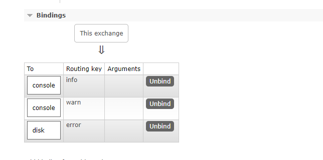

在 Fanout 模式中，是将所有的日志详细广播出去，所有与交换机绑定的队列都会收到消息，并且是一摸一样的。对此我们想做一些改变，例如我们希望将日志消息写入磁盘的程序仅接受 error 类型的日志，而不存储那些 warn 或 info 类型的日志从而到达节省磁盘空间。Fanout 这种交换类型并不能给我们带来很大的灵活性，它只能进行广播，在这里我们将使用 Direct 这种类型来替换，这种类型的工作方式是，消息只去到它绑定的 routingKey 队列中。


在上面的这张图中，可以看到 X 绑定了两个队列，绑定类型是 direct。队列 Q1 绑定键为 orange，队列 Q2 绑定键有两个：一个绑定键为 black，另一个绑定键为 green。

在这种绑定情况下，生产者发布消息到 exchange 上，绑定键为 orange 的消息会被发布到队列 Q1。绑定键为 black 和 green 的消息会被发布到队列 Q2，其它没有匹配上的绑定键的消息将被丢弃。

## 多重绑定


一个 direct 类型的 exchange 绑定的多个队列的 key 都是相同的，在这种情况下，会得到与 Fanout 类型的 exchange 的效果。所以在上诉的这种情况下，交换机收到的 key 为 black 的消息，都会转发到 Q1 和 Q2 两个队列中。

##  Direct 示例
### 日志生产者
```java
public class LogProduct {
    private static final String EXCHANGE_NAME = "direct_logs";
    private static final String[] TYPE = new String[]{"info", "warn", "error", "debug"};

    public static void main(String[] args) {
        try (Channel channel = RabbitMqUtils.getChannel()) {
            channel.exchangeDeclare(EXCHANGE_NAME, BuiltinExchangeType.DIRECT);
            Random random = new Random();
            for (int i = 0; i < 10000; i++) {
                int anInt = random.nextInt(3);
                String msg = StrUtil.format("[{}] 日志消息: {}", TYPE[anInt], i);
                channel.basicPublish(EXCHANGE_NAME, TYPE[anInt], null, msg.getBytes(StandardCharsets.UTF_8));
                System.out.println("发送日志：" + msg);
            }
        } catch (Exception e) {
            e.printStackTrace();
        }
    }
}
```
### 日志消费者
```java
public class LogReceive01 {

    private final static String EXCHANGE_NAME = "direct_logs";

    public static void main(String[] args) throws Exception {

        Channel channel = RabbitMqUtils.getChannel();

        // 声明交换机
        channel.exchangeDeclare(EXCHANGE_NAME, BuiltinExchangeType.DIRECT);

        String queue = "console";
        channel.queueDeclare(queue, false, false, false, null);
        channel.queueBind(queue, EXCHANGE_NAME, "info");
        channel.queueBind(queue, EXCHANGE_NAME, "warn");
        System.out.println("等待接受日志...");

        DeliverCallback deliverCallback = (consumerTag, message) -> {
            String s = new String(message.getBody());
            System.out.println("接收到日志: " + s);
        };

        channel.basicConsume(queue, true, deliverCallback, consumerTag -> System.out.println("cancel"));

    }
}
```
```java
public class LogReceive02 {

    private static final String EXCHANGE_NAME = "direct_logs";

    public static void main(String[] args) throws Exception {
        Channel channel = RabbitMqUtils.getChannel();
        channel.exchangeDeclare(EXCHANGE_NAME, BuiltinExchangeType.DIRECT);

        String queue = "disk";
        channel.queueDeclare(queue, false, false, false, null);
        channel.queueBind(queue, EXCHANGE_NAME, "error");

        System.out.println("等待接受日志...");

        DeliverCallback deliverCallback = (consumerTag, delivery) -> {
            String s = new String(delivery.getBody());
            Path path = Paths.get("E:\\logs.log");
            Files.write(path, delivery.getBody(), StandardOpenOption.APPEND);
            System.out.println("日志写入文件成功: " + s);
        };

        channel.basicConsume(queue, true, deliverCallback, consumerTag -> {
        });
    }
}
```
启动两个消费之后，在 RabbitMQ 的交换机能看到创建了 direct\_logs，点击查看详情能看到它绑定了三个 routingKey：


