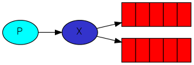

RabbitMQ 消息传递模型的核心思想是：`生产者生产的消息从不会直接发送到队列` 。实际上，通常生产者甚至都不知道自己推送的消息传递到了哪个消息队列中。因此，`生产者只能将消息发送到交换机` ，交换机工作的内容非常简单，一方面它接收来自生产者的消息，另一方面将他们推入队列。交换机必须确切知道如何处理收到的消息，是应该把消息放到特定队列，是把他们广播到许多丢列，还是说丢弃它们，这都是由交换机的类型来决定的。



### 交换机类型
* 直接（Direct）
* 主题（Topic）
* 标题（Headers）
* 扇出/广播（Fanout）

### 无名 exchange
在之前的案例以及代码中，并没有关注到交换机，但消息依然能发送到队列，这是因为之前的案例中给我们一直使用的是 RabbitMQ 提供的默认交换机，通常使用空字符串表示。

```java
// 第一个参数表示的就是交换机，使用 "" 表示使用默认交换机
channel.basicPublish("", "QUEUE_NAME", null, message.getBytes(StandardCharsets.UTF_8));
```
第一个参数是交换机的名称，使用空字符串表示默认或无名交换机。在这里消息之所以能路由发送到队列中，是由第二个参数 routingKey 决定的。exchange 通过 routineKey 去匹配消息队列，如果不存在则创建一个新的队列。

### 临时队列
RabbitMQ 提供了一种临时队列连接方式，即在连接 RabbitMQ 时无需自己去定义队列名称，而是由 RabbitMQ 自己去决定创建，这种队列的特点就是，名称是随机生成的，另外一旦其断开了与消费者的连接后，队列就会自动删除。

```java
public class RandomExchanges {

    public static void main(String[] args) {
        try (Channel channel = RabbitMqUtils.getChannel()) {

            // 主动声明一个服务器命名的独占、自动删除、非持久队列。
            AMQP.Queue.DeclareOk declareOk = channel.queueDeclare();

            System.out.println("临时队列名称：" + declareOk.getQueue());
        } catch (Exception e) {
            e.printStackTrace();
        }
    }
}
```


### Bingding
Exchange 和 Queue 之间的虚拟连接，Binding 中可以包含 Routing Key，Binding 信息被保存到 Exchange 中的查询表中，用于 Message 的分发依据。


