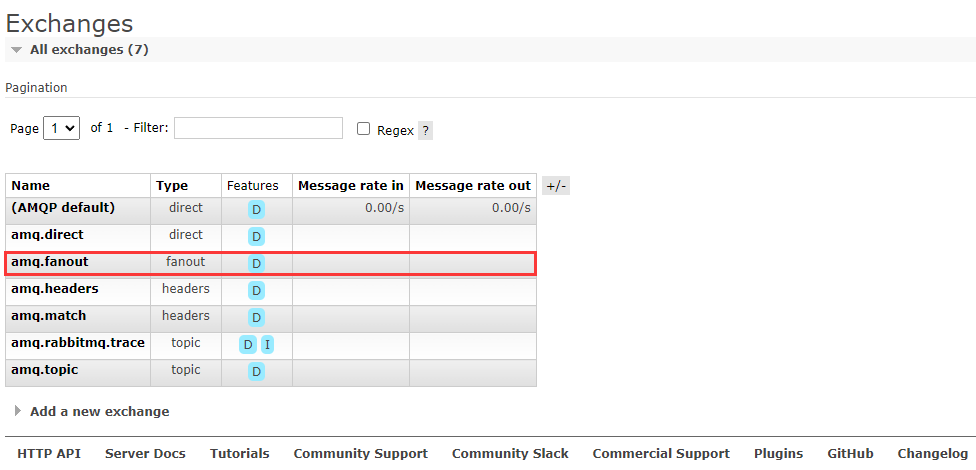
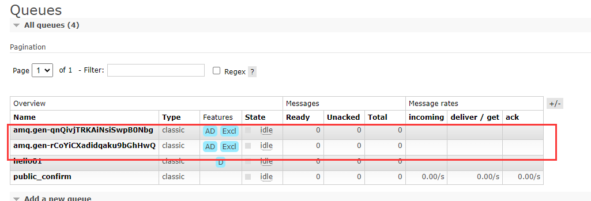

Fanout 类型的交换机会叫所有的消息广播到它所绑定的队列中。在 RabbitMQ 中有提供默认的 Fanout 类型的交换机。



## Fanout 示例
在下面的示例中，会创建两个消费者，一个生产者来模拟系统日志处理过程，生产者将自己输出的日志，发送到指定的交换机，交换机再将日志消息分发到所绑定的消息队列中。然后两个消费分别中队列中获取日志消息，一个消费者将消息打印到控制态，另一个消费者将消息写入到文件。


### 日志生产者
```java
public class LogProduct {

    private static final String EXCHANGE_NAME = "logs";

    public static void main(String[] args) {
        try (Channel channel = RabbitMqUtils.getChannel()) {
            channel.exchangeDeclare(EXCHANGE_NAME, BuiltinExchangeType.FANOUT);
            for (int i = 0; i < 10000; i++) {
                String msg = StrUtil.format("[{}] 日志消息: {}", i, i);
                channel.basicPublish(EXCHANGE_NAME, "", null, msg.getBytes(StandardCharsets.UTF_8));
                System.out.println("发送日志：" + msg);
            }
        } catch (Exception e) {
            e.printStackTrace();
        }
    }
}
```
### 消息接收者
```java
public class LogReceive01 {

    private final static String EXCHANGE_NAME = "logs";

    public static void main(String[] args) throws Exception {

        Channel channel = RabbitMqUtils.getChannel();

        // 声明交换机
        channel.exchangeDeclare(EXCHANGE_NAME, BuiltinExchangeType.FANOUT);
        // 获取随机队列
        String queue = channel.queueDeclare().getQueue();
        // 将刚创建的队列绑定到交换机上
        channel.queueBind(queue, EXCHANGE_NAME, "");

        System.out.println("等待接受日志...");

        DeliverCallback deliverCallback = (consumerTag, message) -> {
            String s = new String(message.getBody());
            System.out.println("接收到日志: " + s);
        };

        channel.basicConsume(queue, true, deliverCallback, consumerTag -> System.out.println("cancel"));
    }
}
```
```java
public class LogReceive02 {

    private static final String EXCHANGE_NAME = "logs";

    public static void main(String[] args) throws Exception {
        Channel channel = RabbitMqUtils.getChannel();
        channel.exchangeDeclare(EXCHANGE_NAME, BuiltinExchangeType.FANOUT);
        String queue = channel.queueDeclare().getQueue();
        channel.queueBind(queue, EXCHANGE_NAME, "");

        System.out.println("等待接受日志...");

        DeliverCallback deliverCallback = (consumerTag, delivery) -> {
            String s = new String(delivery.getBody());
            Path path = Paths.get("E:\\logs.log");
            Files.write(path, delivery.getBody(), StandardOpenOption.APPEND);
            System.out.println("日志写入文件成功: " + s);
        };

        channel.basicConsume(queue, true, deliverCallback, consumerTag -> {
        });
    }
}

```
首先启动两个消费者，之后在 RabbitMQ 中的 exchange 中就会发现多了一个交换机 logs，在 queue 中创建了两个随机队列。


