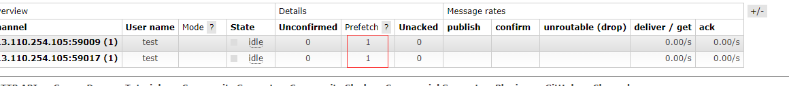
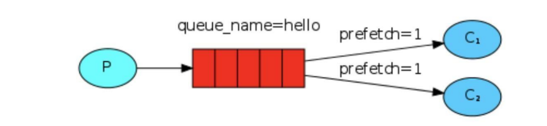
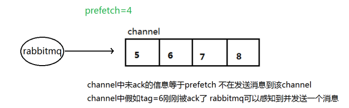

在 RabbitMQ 中，队列中的消息是存在系统内存中的，一旦服务宕机断电，那么队列中的消息也就丢失了。为了解决这一问题，RabbitMQ 引入了消息持久化，但它默认不是开启，需要在我们自己去标记那些队列和消息需要持久化。

## 队列持久化
```java
boolean durable = true;
channel.queueDeclare(QUEUE_NAME, durable, false, false, null);
```
`queueDeclare` 方法的第二参数就是用来标记该队列是否需要持久化的，但这里需要注意的是，如果当前我们声明的队列已存在 RabbitMQ 服务中，且是非持久化的，需要先将其删除，不然会出现错误。

```Plain Text
Caused by: com.rabbitmq.client.ShutdownSignalException: channel error; protocol method: #method<channel.close>(reply-code=406, reply-text=PRECONDITION_FAILED - inequivalent arg 'durable' for queue 'hello' in vhost 'my_vhost': received 'true' but current is 'false', class-id=50, method-id=10)
```
在 RabbitMQ 控制台中，查看队列信息的表格中，持久化队列在 `Features`  列中的值是 `D` ，非持久化队列中则没有，如下：


如果这时重启 RabbitMQ 会发现表中只剩下了 `hello01` 这个队列。

## 消息持久化
```java
// 内容类型“text/plain”，deliveryMode 2（持久），优先级为零
AMQP.BasicProperties props = MessageProperties.PERSISTENT_TEXT_PLAIN;
channel.basicPublish("", QUEUE_NAME, props, message.getBytes(StandardCharsets.UTF_8));
```
要想消息持久化，需要在消息生产者在调用 `basicPublish` 推送消息时，传入参数 `MessageProperties.PERSISTENT_TEXT_PLAIN` ，该配置项会告诉 RabbitMQ 这条消息是需要持久化的。

虽然我们告诉了 RabbitMQ 这条消息需要持久化，但它并不能百分百保证消息不会丢失。因为消息持久化是将内存数据持久化到磁盘，这里存在一个持久化的过程，如果 RabbitMQ 服务在这个过程中发生异常，例如宕机、断电那么消息必然就会发生丢失。所以这里消息持久性保证并不强。但对于简单任务丢列来说，这已经足够满足我们的需求，如果需要更强有力的持久化策略，需要使用到它的发布确认模式。

## 不公平分发
RabbitMQ 默认采用轮询分发的机制去分发队列中的消息，这种机制在某些场景下并不合适，特别是当多个消费者消费能力差异大的时候，这就会导致处理能力强的消费者会出现空闲，处理能力差的消费者一直在忙；这就会出现性能上的浪费。为了避免这种情况，可以设置如下参数：

```java
// 请求此频道的特定 prefetchCount“服务质量”设置。
// 请注意，预取计数必须介于 0 和 65535 之间（AMQP 0-9-1 中的 unsigned short）。
channel.basicQos(1);
```




## prefetch 预取值
RabbitMQ 消息的发送是异步的，所以在任何时候，channel 上存在不止一条消息，另外消费者的手动确认消息也是异步，因此这里就存在一个未确认的消息缓冲区。在使用 RabbitMQ 时，需要注意 `限制该缓冲区大小，避免缓存区无限制怎么加未确认的消息` 。我们可以通过调用 channel 的 `basicQos` 方法设置 `预取计数` 值来控制该缓冲区大小。`该值定义通道上允许的未确认消息的最大数量` 。一旦数量达到配置的数量，RabbitMQ 将停止在通道上传递更多的消息，除非至少有一个未处理的消息被确认。假设在通道上有未确认的消息 5、6、7、8，并且通道的预取计数是 4 ，此时 RabbitMQ 将不会在该通道上传递任何消息，除非至少有一个未应答的消息被 ACK。比方说 tag = 6 这个消息刚刚被确认 ACK，RabbitMQ 将会感知这个情况并再发送一条消息。




消息应答和 QoS 预取值对用户吞吐量有重大影响。通常，增加预取将提高向消费者传递消息的速度。虽然`自动应答传输消息速率是最佳的，但是在这种情况下已传递但尚未处理的消息的数量也会增加，从而增加消费者的 RAM 消耗（随机存取存储器）` ，所以应该`小心使用具有无限预处理的自动确认模式或手动确认模式`，消费者消费了大量的消息如果没有确认的话，会导致消费者连接节点的内存消耗变大，所以找到合适的预取值是一个反复实验的过程，不同的负载预取值也不同，`100 到 300 范围内的值通常可提供最佳的吞吐量，并且不会给消费者带来太大的风险`。预取值为 1 是最保守的。当然这将使吞吐量变得很低，特别是消费者连接延迟很严重的情况下，或是在消费者连接等待时间较长的环境中。
