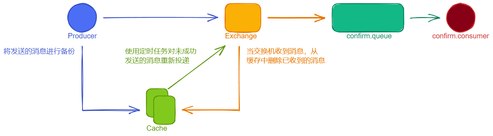
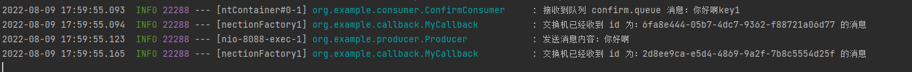
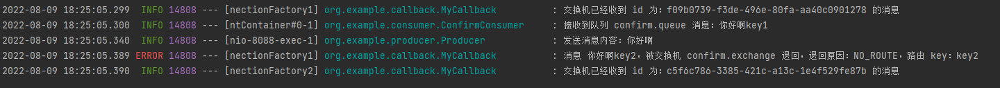
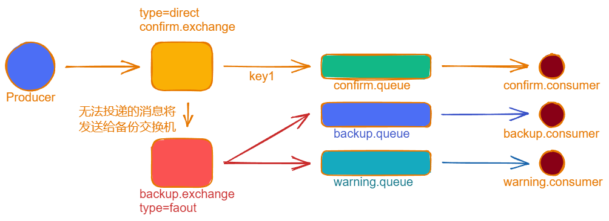
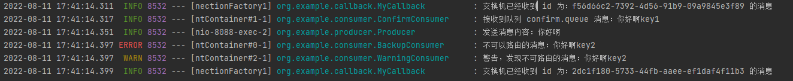

在生产环境中由于一些不明原因，导致 RabbitMQ 重启，在 RabbitMQ 重启期间生产者消息投递失败，导致消息丢失，需要手动处理和恢复。于是，我们开始思考，如何才能进行 RabbitMQ 的消息可靠投递呢？特别是在这样比较极端的情况下，RabbitMQ 集群不可用的时候，无法投递的消息该如何处理？

为了解决这个问题，可以通过 RabbitMQ 的发布确认来解决，消息生产者将消息投递到 MQ 当 MQ 收到消息后，进行一个反聩，消息生产者通过这个反馈来辨别消息是否成功投递。



## 代码架构图


## 代码演示
### application.yml
```yaml
server:
  port: 8088
spring:
  application:
    name: publish-confirm
  rabbitmq:
    host: 12.156.14.15
    port: 5672
    username: test
    password: test
    virtual-host: my_vhost
    # none: 禁用发布确认模式，是默认值
    # correlated: 发布消息成功到交换机会触发会回调方法
    publisher-confirm-type: correlated
```
### 配置类 ConfirmConfig
```java
@Configuration
public class ConfirmConfig {

    private static final String CONFIRM_EXCHANGE_NAME = "confirm.exchange";
    private static final String CONFIRM_QUEUE_NAME = "confirm.queue";

    /**
     * 声明交换机
     */
    @Bean("confirmExchange")
    public DirectExchange confirmExchange() {
        return new DirectExchange(CONFIRM_EXCHANGE_NAME);
    }

    /**
     * 声明队列
     */
    @Bean("confirmQueue")
    public Queue confirmQueue() {
        return QueueBuilder.durable(CONFIRM_QUEUE_NAME).build();
    }

    /**
     * 将队列与交换机绑定
     */
    @Bean
    public Binding queueBinding(@Qualifier("confirmQueue") Queue queue, @Qualifier("confirmExchange") DirectExchange exchange) {
        return BindingBuilder.bind(queue).to(exchange).with("key1");
    }
}
```
### 消息生产者 Producer
```java
@Slf4j
@RestController
@RequestMapping("/confirm")
public class Producer {

    private static final String CONFIRM_EXCHANGE_NAME = "confirm.exchange";

    @Autowired
    private RabbitTemplate rabbitTemplate;

    @Autowired
    private MyCallback myCallback;

    @PostConstruct
    public void inti() {
        // 确认消息的回调
        rabbitTemplate.setConfirmCallback(myCallback);
    }

    @GetMapping("/sendMessage/{message}")
    public void sendMessage(@PathVariable("message") String message) {

        String routingKey = "key1";
        rabbitTemplate.convertAndSend(CONFIRM_EXCHANGE_NAME, routingKey, message + routingKey, new CorrelationData());

        routingKey = "key2";
        rabbitTemplate.convertAndSend(CONFIRM_EXCHANGE_NAME, routingKey, message + routingKey, new CorrelationData());

        log.info("发送消息内容：{}", message);

    }
}
```
### 回调接口 MyCallback
```java
@Slf4j
@Component
public class MyCallback implements RabbitTemplate.ConfirmCallback {
    @Override
    public void confirm(CorrelationData correlationData, boolean ack, String cause) {
        String id = correlationData != null ? correlationData.getId() : "";

        if (ack) {
            log.info("交换机已经收到 id 为：{} 的消息", id);
        } else {
            log.info("交换机还未收到 id 为：{} 的消息，原因：{}", id, cause);
        }
    }
}

```
### 消费者 ConfirmConsumer
```java
@Slf4j
@Component
public class ConfirmConsumer {

    private static final String CONFIRM_QUEUE_NAME = "confirm.queue";

    @RabbitListener(queues = CONFIRM_QUEUE_NAME)
    public void receiveMsg(Message message) {
        String msg = new String(message.getBody());
        log.info("接收到队列 confirm.queue 消息：{}", msg);
    }
}
```
### 启动程序
发送请求：http://localhost:8088/confirm/sendMessage/你好啊



从日志中可以看到，一共向 MQ 发送了两条消息，第一条消息的 routingKey 是 key1，第二条消息的 routingKey 是 key2，两条消息都成功被交换机接受，也受到了交换机的确认回调，但消费者只收到了一条消息，因为第二条消息的 routingKey 与队列的 bindingKey 不一致，导致这条消息没有队列接收，所以第二条消息被直接丢弃了。

## 回退消息
### Mandatory 参数
`在仅开启了生产者确认机制的情况下，交换机接收到消息后，会直接给消息生产者发送确认消息，如果发现该消息不可路由，那么消息会被直接丢弃，此时生产者是不知道消息被丢弃这个事件的`。那么如何处理无法被路由的消息呢？RabbitMQ 通过配置 mandatory 参数，可以在消息传递过程中不可到达目的地时将消息返回给生产者。

### 生产者
```java
@Slf4j
@RestController
@RequestMapping("/confirm")
public class Producer {

    private static final String CONFIRM_EXCHANGE_NAME = "confirm.exchange";

    @Autowired
    private RabbitTemplate rabbitTemplate;

    @Autowired
    private MyCallback myCallback;

    @PostConstruct
    public void init() {
        // 确认消息的回调
        rabbitTemplate.setConfirmCallback(myCallback);
        // 回退消息的回调
        rabbitTemplate.setReturnsCallback(myCallback);
        /*
         * true:
         *  交换机无法将消息进行路由时，会将该消息返回给生产者
         * false：
         *  如果发现消息无法进行路由，则直接丢弃
         *
         */
        rabbitTemplate.setMandatory(true);
    }

    @GetMapping("/sendMessage/{message}")
    public void sendMessage(@PathVariable("message") String message) {

        String routingKey = "key1";
        rabbitTemplate.convertAndSend(CONFIRM_EXCHANGE_NAME, routingKey, message + routingKey, new CorrelationData());

        routingKey = "key2";
        rabbitTemplate.convertAndSend(CONFIRM_EXCHANGE_NAME, routingKey, message + routingKey, new CorrelationData());

        log.info("发送消息内容：{}", message);

    }
}
```
### 回调接口
```java
@Slf4j
@Component
public class MyCallback implements RabbitTemplate.ConfirmCallback, RabbitTemplate.ReturnsCallback {
    @Override
    public void confirm(CorrelationData correlationData, boolean ack, String cause) {
        String id = correlationData != null ? correlationData.getId() : "";

        if (ack) {
            log.info("交换机已经收到 id 为：{} 的消息", id);
        } else {
            log.info("交换机还未收到 id 为：{} 的消息，原因：{}", id, cause);
        }
    }

    @Override
    public void returnedMessage(ReturnedMessage returned) {
        log.error("消息 {}，被交换机 {} 退回，退回原因：{}，路由 key：{}",
                new String(returned.getMessage().getBody()),
                returned.getExchange(),
                returned.getReplyText(),
                returned.getRoutingKey()
        );
    }
}
```
### 启动程序
发送请求：http://localhost:8088/confirm/sendMessage/你好啊



## 备份交换机
有了 mandatory 参数和回退消息，我们获得了对无法投递的消息的感知能力，有机会在生产者消息无法被投递时发现并处理。但有时候，我们并不知道该如何处理这些无法路由的消息，最多打个日志，然后触发报警，再来手动处理。而通过日志来处理这些无法被路由的消息是很不优雅的做法，特别是当生产者所在的服务器有多台的时候，手动复制日志会更加麻烦而且容易出错。而且设置 mandatory 参数会增加生产者的复杂性，需要添加处理这些被退回的消息的逻辑。如果既不想丢失消息，又不想增加生产者的复杂性，该怎么做呢？前面在学习死信队列的时候，我们提到了可以为队列设置死信交换机来存储那些处理失败的消息，可是这些不可路由的消息根本没有机会进入到队列中，因此无法使用死信队列来保存消息。在 RabbitMQ 中，有一种备份交换机的机制存在，可以很好的应对这个问题。什么是备份交换机呢？备份交换机可以理解为 RabbitMQ 中交换机的”备胎“，当我们为某一个交换机声明一个对应的备份交换机时，就是为它创建一个备胎，当交换机接收到一条不可路由的消息时，将会把这条消息转发到备份交换机中，由备份交换机来进行转发和处理，通常备份交换机的类型为 Fanout，这样就能把所有消息投递到与其绑定的队列中，然后我们在备份交换机下绑定一个队列，这样所有那些原交换机无法被路由的消息，就会都进入这个队列中。当然，我们还可以建立一个报警队列，用独立的消费者来进行检测和报警。



### 代码演示
#### 修改配置类
```java
@Configuration
public class ConfirmConfig {

    private static final String CONFIRM_EXCHANGE_NAME = "confirm.exchange";
    private static final String CONFIRM_QUEUE_NAME = "confirm.queue";
    private static final String BACKUP_EXCHANGE_NAME = "backup.exchange";
    private static final String BACKUP_QUEUE_NAME = "backup.queue";
    private static final String WARNING_QUEUE_NAME = "warning.queue";

    /**
     * 声明备份交换机
     */
    @Bean("backupExchange")
    public FanoutExchange backupExchange() {
        return new FanoutExchange(BACKUP_EXCHANGE_NAME);
    }

    /**
     * 声明交换机
     */
    @Bean("confirmExchange")
    public DirectExchange confirmExchange() {
        return ExchangeBuilder.directExchange(CONFIRM_EXCHANGE_NAME)
                .durable(true)
                // 设置该交换机的备份交换机
                .withArgument("alternate-exchange", BACKUP_EXCHANGE_NAME)
                .build();
    }

    /**
     * 声明队列
     */
    @Bean("confirmQueue")
    public Queue confirmQueue() {
        return QueueBuilder.durable(CONFIRM_QUEUE_NAME).build();
    }

    /**
     * 将队列与交换机绑定
     */
    @Bean
    public Binding queueBinding(@Qualifier("confirmQueue") Queue queue, @Qualifier("confirmExchange") DirectExchange exchange) {
        return BindingBuilder.bind(queue).to(exchange).with("key1");
    }


    /**
     * 声明警告队列
     */
    @Bean("warningQueue")
    public Queue warningQueue() {
        return QueueBuilder.durable(WARNING_QUEUE_NAME).build();
    }

    /**
     * 警告队列绑定交换机
     */
    @Bean
    public Binding warningBinding(@Qualifier("warningQueue") Queue queue, @Qualifier("backupExchange") FanoutExchange backupExchange) {
        return BindingBuilder.bind(queue).to(backupExchange);
    }

    /**
     * 声明备份队列
     */
    @Bean("backupQueue")
    public Queue backupQueue() {
        return QueueBuilder.durable(BACKUP_QUEUE_NAME).build();
    }

    /**
     * 备份队列绑定交换机
     */
    @Bean
    public Binding backupBinging(@Qualifier("backupQueue") Queue queue, @Qualifier("backupExchange") FanoutExchange backupExchange) {
        return BindingBuilder.bind(queue).to(backupExchange());
    }
}
```
#### 消息生产者保持不变
#### 报警队列消费者
```java
@Slf4j
@Component
public class WarningConsumer {

    private static final String WARNING_QUEUE_NAME = "warning.queue";

    @RabbitListener(queues = WARNING_QUEUE_NAME)
    public void receiveWarningMsg(Message message) {
        log.warn("警告，发现不可路由的消息：" + new String(message.getBody()));
    }

}
```
#### 备份队列消费者
```java
@Slf4j
@Component
public class BackupConsumer {

    private static final String BACKUP_QUEUE_NAME = "backup.queue";

    @RabbitListener(queues = BACKUP_QUEUE_NAME)
    public void receiveBackupMsg(Message message) {
        log.error("不可以路由的消息：" + new String(message.getBody()));
    }
}
```
调用接口：http://localhost:8088/confirm/sendMessage/你好啊



由于消息生产者并没有变动，所在在这个案例中，即配置 mandatory 参数同时也配置备份队列，在这两者同时存在的情况下，当消息不可路由时，消息会被传递到备份队列中，而不会调用配置的回调接口，`即 mandatory 参数与备份交换机同时存在时，备份交换机处理消息的优先级更高`。
