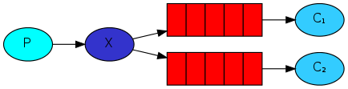

## RabbitMQ 的概念
RabbitMQ 是一个消息中间件：它接受并转发消息。你可以把它当做一个快递站点，当你要发送一个包裹时，你把你的包裹放到快递站，快递员最终会把你的快递送到收件人那里，按照这种逻辑 RabbitMQ 是一个快递站，一个快递员帮你传递快件。RabbitMQ 与快递站的主要区别在于，它不处理快件而是接收，存储和转发消息数据。

## 四大核心概念

### 生产者
产生数据发送消息的程序是生产者

### 交换机
交换机是 RabbitMQ 非常重要的一个部件，一方面它接收来自生产者的消息，另一方面它将消息推送到队列中。交换机必须确切知道如何处理它接收到的消息，是将这些消息推送到特定队列还是推送到多个队列，亦或者是把消息丢弃，这个是由交换机类型决定。

### 队列
队列是 RabbitMQ 内部使用的一种数据结构，尽管消息流经 RabbitMQ 和应用程序，但它们只能存储在队列中。队列仅受主机的内存和磁盘限制的约束，本质上是一个大的消息缓冲区。生产者可以将消息发送到一个队列，消费者可以尝试从一个队列接收数据。这就是我们使用队列的方式。

### 消费者
消费与接收具有相似的含义。消费者大多时候是一个等待接收消息的程序。请注意生产者，消费者和消息中间件很多时候并不在同一机器上。同一个应用程序既可以是生产者又是可以是消费者。

## RabbitMQ 工作模式

### Simple

做最简单的事情，一个生产者对应一个消费者，RabbitMQ 相当于一个消息代理，负责将A的消息转发给B。

**应用场景：** 将发送的电子邮件放到消息队列，然后邮件服务在队列中获取邮件并发送给收件人。

### Work queues

在多个消费者之间分配任务（竞争的消费者模式），一个生产者对应多个消费者，一般适用于执行资源密集型任务，单个消费者处理不过来，需要多个消费者进行处理。

**应用场景**： 一个订单的处理需要10s，有多个订单可以同时放到消息队列，然后让多个消费者同时处理，这样就是并行了，而不是单个消费者的串行情况。

### Publish/Subscribe

一次向许多消费者发送消息，一个生产者发送的消息会被多个消费者获取，也就是将消息将广播到所有的消费者中。

**应用场景**： 更新商品库存后需要通知多个缓存和多个数据库，这里的结构应该是：

* 一个fanout类型交换机扇出两个个消息队列，分别为缓存消息队列、数据库消息队列
* 一个缓存消息队列对应着多个缓存消费者
* 一个数据库消息队列对应着多个数据库消费者

### Routing

有选择地（Routing key）接收消息，发送消息到交换机并且要指定路由 key ，消费者将队列绑定到交换机时需要指定路由 key，仅消费指定路由 key 的消息。

**应用场景**： 如在商品库存中增加了1台 iphone12，iphone12 促销活动消费者指定 routing key 为 iphone12，只有此促销活动会接收到消息，其它促销活动不关心也不会消费此 routing key 的消息。

### Topics

根据主题（Topics）来接收消息，将路由 key 和某模式进行匹配，此时队列需要绑定在一个模式上，# 匹配一个词或多个词，\* 只匹配一个词。

**应用场景：** 同上，iphone 促销活动可以接收主题为 iphone 的消息，如 iphone12、iphone13 等。

### RPC

如果我们需要在远程计算机上运行功能并等待结果就可以使用RPC，具体流程可以看图。

**应用场景**：需要等待接口返回数据，如订单支付。

### Publisher Confirms
与发布者进行可靠的发布确认，Publisher Confirms 是 RabbitMQ 扩展，可以实现可靠的发布。在通道上启用 Publisher Confirms，RabbitMQ 将异步确认发送者发布的消息，这意味着它们已在服务器端处理。

**应用场景：** 对于消息可靠性要求较高，比如钱包扣款。

## 工作原理

* **Broker**：接收和分发消息的应用，RabbitMQ Server 就是 Message Broker。
* **Virtual host**：出于多租户和安全因素设计的，把 AMQP 的基本组件划分到一个虚拟的分组中，类似于网络中的 namespace 概念。当多个不同的用户使用同一个 RabbitMQ server 提供的服务时，可以划分出多个 VHost，每个用户在自己的 VHost 创建 Exchange 和 Queue 等。
* **Connection**：Publisher/Consumer 和 Broker 之间的 TCP 连接。
* **Channel**：如果每一次访问 RabbitMQ 都建立一个 Connection，在消息量大的时候建立 TCP Connection 的开销将是巨大的，效率也较低。Channel 是在 Connection 内部建立的逻辑连接，如果应用程序支持多线程，通常每个 Thread 创建单独的 Channel 进行通讯，AMQP Method 包含了 Channel Id 帮助客户端和 Message Broker 识别 Channel，所以 Channel 之间是完全隔离的。Channel 作为轻量级的 Connection 极大减少了操作系统建立 TCP Connection 的开销。
* **Exchange**：Message 到达 Broker 的第一站，根据分发规则，匹配查询表中的 Routing Key，分发消息到 Queue 中去。常用的类型有：Direct (Point-To-Point)、Topics (Publish-Subscribe) 、Fanout (Multicast)。
* **Queue**：消息最终被送到这里等待 Consumer 取走。
* **Binding**：Exchange 和 Queue 之间的虚拟连接，Binding 中可以包含 Routing Key，Binding 信息被保存到 Exchange 中的查询表中，用于 Message 的分发依据。
