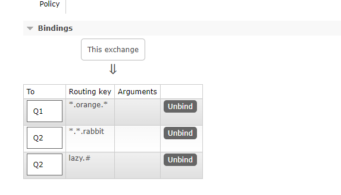

Direct 解决了每个队列只接受自己想要收到的消息，实现了选择性接受消息。但它仍然存在局限性，比方说我们想接收的日志类型有 info.base 和 info.advantage，某个队列只想 info.base 的消息，那这个时候 direct 就办不到了。这个时候就只能使用 Topic 类型了。

发送到类型为 Topic 的交换机的消息的 routingKey 必须满足一定的要求，`它必须是一个单词列表，以点号分隔开`。比如说：`stock.usd.nyse`，`nyse.vmw`，`quick.orange.rabbit`。这种类型的。当然这个单词列表最多不能超过 255 个字节。除此之外，它还支持一些特殊符号组成的表达式。

* `*` 可以代替一个单词
* `#` 可以替代零个或多个单词


如上图：

* Q1 绑定是 `中间带 orange 的带 3 个单词的字符串`
* Q2 绑定是 `以 rabbit 结尾的带 3 个单词的字符串` 和 `以 lazy 开头的多个单词的字符串`

以下是一些匹配例子：

* quick.orange.rabbit：被队列 Q1、Q2 接收到
* lazy.orange.elephant：被队列 Q1、Q2 接收到
* quick.orange.fox：被队列 Q1 接收到
* lazy.brown.fox：被队列 Q2 接收到
* lazy.pink.rabbit：虽然满足两个绑定但只被队列 Q2 接收一次
* quick.brown.fox：不匹配任何绑定不会被任何队列接收到会被丢弃
* quick.orange.male.rabbit：是四个单词不匹配任何绑定会被丢弃
*  lazy.orange.male.rabbit：是四个单词但匹配 Q2

## 注意
当队列绑定关系是下列这种情况时需要引起注意

* 当一个队列绑定键是#,那么这个队列将接收所有数据，就有点像 fanout 了
* 如果队列绑定键当中没有#和\*出现，那么该队列绑定类型就是 direct 了

## Topic 示例
### 生产者
```java
public class Product {
    private static final String EXCHANGE_NAME = "topic_logs";

    public static void main(String[] args) {
        try (Channel channel = RabbitMqUtils.getChannel()) {
            channel.exchangeDeclare(EXCHANGE_NAME, BuiltinExchangeType.TOPIC);
            Map<String, String> bindingKeyMap = new HashMap<>();
            bindingKeyMap.put("quick.orange.rabbit", "被队列 Q1、Q2 接收到");
            bindingKeyMap.put("lazy.orange.elephant", "被队列 Q1、Q2 接收到");
            bindingKeyMap.put("quick.orange.fox", "被队列 Q1 接收到");
            bindingKeyMap.put("lazy.brown.fox", "被队列 Q2 接收到");
            bindingKeyMap.put("lazy.pink.rabbit", "虽然满足两个绑定但只被队列 Q2 接收一次");
            bindingKeyMap.put("quick.brown.fox", "不匹配任何绑定不会被任何队列接收到会被丢弃");
            bindingKeyMap.put("quick.orange.male.rabbit", "是四个单词不匹配任何绑定会被丢弃");
            bindingKeyMap.put("lazy.orange.male.rabbit", "是四个单词但匹配 Q2");

            for (Map.Entry<String, String> bindingKeyEntry : bindingKeyMap.entrySet()) {
                String bindingKey = bindingKeyEntry.getKey();
                String message = bindingKeyEntry.getValue();
                channel.basicPublish(EXCHANGE_NAME, bindingKey, null, message.getBytes(StandardCharsets.UTF_8));
                System.out.println("生产者发出消息" + message);
            }
        } catch (Exception e) {
            e.printStackTrace();
        }
    }
}
```
### 消费者
```java
public class Consumer01 {

    private final static String EXCHANGE_NAME = "topic_logs";

    public static void main(String[] args) throws Exception {

        Channel channel = RabbitMqUtils.getChannel();

        // 声明交换机
        channel.exchangeDeclare(EXCHANGE_NAME, BuiltinExchangeType.TOPIC);

        String queue = "Q1";
        channel.queueDeclare(queue, false, false, false, null);
        channel.queueBind(queue, EXCHANGE_NAME, "*.orange.*");
        System.out.println("等待接受消息...");
        DeliverCallback deliverCallback = (consumerTag, delivery) -> {
            String s = new String(delivery.getBody());
            System.out.println("接收到消息: " + s);
        };
        channel.basicConsume(queue, true, deliverCallback, consumerTag -> System.out.println("cancel"));
    }
}
```
```java
public class Consumer02 {

    private static final String EXCHANGE_NAME = "topic_logs";

    public static void main(String[] args) throws Exception {
        Channel channel = RabbitMqUtils.getChannel();
        channel.exchangeDeclare(EXCHANGE_NAME, BuiltinExchangeType.TOPIC);

        String queue = "Q2";
        channel.queueDeclare(queue, false, false, false, null);
        channel.queueBind(queue, EXCHANGE_NAME, "*.*.rabbit");
        channel.queueBind(queue, EXCHANGE_NAME, "lazy.#");

        System.out.println("等待接受消息...");

        DeliverCallback deliverCallback = (consumerTag, delivery) -> {
            String s = new String(delivery.getBody());
            System.out.println("接收到消息: " + s);
        };

        channel.basicConsume(queue, true, deliverCallback, consumerTag -> {
        });
    }
}
```
启动两个消费之后，在 RabbitMQ 的交换机能看到创建了 topic\_logs，点击查看详情能看到它绑定了三个 routingKey：


