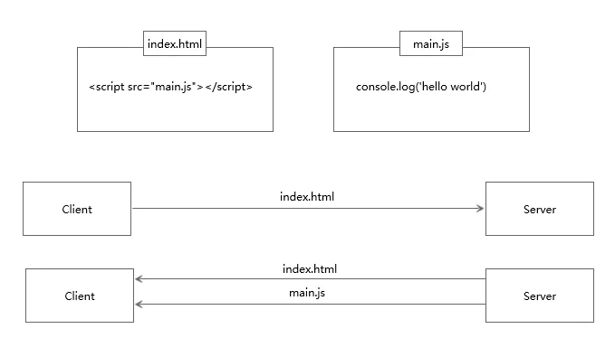

http 请求建立之初，其目的是为了将超文本标记语言（HTML）文档从 Web 服务器传送到客户端的浏览器中。但随着 Web 2.0 的到来，客户端浏览器的页面变得多样化，比以前更复杂，其传输的不再只是 HTML 页面，还有 CSS 和 Javascript；当 Ajax 出现之后，前端又多了一种与服务器交互的方式，这些所有的实现都是基于 HTTP 协议的。在移动设备也开始支持浏览器访问后，HTTP 早期的版本已经不能满足如此复杂的网络环境，于是不得不对 http 进行重新认识理解和不断优化。

## HTTP的基本优化

影响一个 HTTP 网络请求的因素主要有两个：**宽带**和**延迟**

### 宽带

在使用拨号上网的时代，宽带也是一个影响网络请求的主要原因，但是随着网络基础建设的完善以及网络设备的发展，宽带已经算不上是一个影响网络请求的原因了，问题的焦点转移到了**延迟**。

### 延迟

* 浏览器阻塞（HOL Blocking）：浏览器会因为一些原因阻塞请求。浏览器对于同一个域名，同时只能有 4 个连接（这个会根据浏览器内核不同可能会有所差异），超过浏览器最大连接数限制，后续的请求就会被阻塞。
* DNS 查询（DNS Lookup）：浏览器需要知道目标服务器 IP 才能建立连接，这是通过 DNS 来解析的，访问 DNS 解析域名的过程也需要消耗时间的，这个可以利用 DNS 缓存结果来达到缩短解析时间的效果。
* 建立连接（Initial Connection）：HTTP 是基于 TCP 协议的，浏览器最快也要在第三次握手时才能捎带 HTTP 请求报文，达到真正的建立连接，但是这些连接无法复用，这就导致了每次请求都要经历三次握手和慢启动。三次握手在高延迟的场景下影响较明显，慢启动则对大文件请求影响较大。

## HTTP1.0与HTTP1.1的一些区别

HTTP1.0 最早是在 1996 年使用到网页中的，它被使用在一些较为简单的网页上和网络请求中，但随着各大浏览器的问世，在 1999 年 HTTP1.1 问世，就当前 HTTP1.1 仍是使用得最为广泛的 HTTP 协议。HTTP1.0 与 HTTP1.1 的主要区别体现在：

1. **缓存处理**：在 HTTP1.0 中主要是用 header 里的 **If-Modified-Since**，**Expires** 来作为缓存判断的标准，HTTP1.1 则引入了更多的缓存控制策略，例如 **Entity tag**，**If-Unmodified-Since**，**If-Match**，**If-None-Match** 等更多可提供的缓存头来控制缓存策略。
2. **宽带优化及网络连接的使用**：HTTP1.0 中，存在一些浪费宽带的现象，例如客户端只是需要某个对象的一部分，而服务器却将整个对象送过来了，并且不支持断点续传功能，HTTP1.1 则在请求头引入了 **range 头域**，它允许请求资源的某个部分，即返回码是 206（Partial Content），这样就方便了开发者自由的选择以便于充分利用宽带和连接。
3. **错误通知的管理**：在 HTTP1.1 中新增了 24 个错误状态响应码，如 409（Conflict）表示请求的资源与资源的当前状态发生冲突；401（Gone）表示服务器上的某个资源被永久性的删除。
4. **Host头处理**：在 HTTP1.0 中认为每台服务器都绑定一个唯一的 IP 地址，因此，请求消息中的 URL 并没有传递主机名（hostname）。但随着虚拟主机技术的发展，在一台物理服务器上可以存在多个虚拟主机（Multi-homed Web Servers），并且他们共享一个 IP 地址。HTTP1.1 的请求消息和响应消息都应支持 Host头域，且请求消息中如果没有 Host 头域会报告一个错误（400 Bad Request）。
5. **长连接**：HTTP1.1 支持长连接（PersistentConnection）和请求的流水线（Pipelining）处理，在一个 TCP 连接上可以传送多个 HTTP 请求和响应，减少了建立和关闭连接的消耗和延迟，在 HTTP1.1 中默认开启 Connection：keep-alive，一定程度上弥补了 HTTP1.0 每次请求都会创建新连接的缺点。

## HTTPS与HTTP的一些区别

1. HTTPS 协议需要到 CA 申请证书，一般免费证书很少，需要缴费；
2. HTTP 协议运行在 TCP 之上，所有传输的内容都是明文，HTTPS 运行在 SSL/TLS 之上，SSL/TLS 运行在 TCP 之上，所有传输的内容都是经过加密的；
3. HTTP 和 HTTPS 使用的是完全不同的连接方式，用的端口也不一样，前者是 80，后者是 443；
4. HTTPS 可以有效的防止运行商劫持，解决了防劫持的一个大问题。

## SPDY：HTTP1.x的优化

2012 年 google 如一声惊雷提出了 SPDY 的方案，优化了 HTTP1.X 的请求延迟，解决了 HTTP1.X 的安全性，具体如下：

1. **降低延迟**：针对 HTTP 高延迟的问题，SPDY 优雅的采取了多路复用（multiplexing）。多路复用通过多个请求 stream 共享一个 Tcp 连接的方式，解决了 HOL Blocking 的问题，降低了延迟同时提高了宽带的利用率；
2. **请求优先级（Request Prioritization）**：多路复用带来一个新的问题，在连接共享的基础之上有可能会导致关键请求被阻塞。SPDY 允许给每个 request 设置优先级，这样重要的请求会优先得到相应。比如浏览器加载首页，首页的 html 内容应该优先展示，之后才是各种静态资源文件，脚本文件等加载，这样可以保证用户能第一时间看到网页内容；
3. **header 压缩**：前面提到 HTTP1.x 的 header 很多时候都是重复多余的。选择合适的压缩算法可以减小包的大小和数量；
4. **基于 HTTPS 的机密协议传输**：大大提高了传输数据的可靠性；
5. **服务端推送（Server Push）**：采用了 SPDY 的网页，例如我的网页有一个 style.css 的请求，在客户端收到 style.css 数据的同时，服务端会将 style.js 的文件推送给客户端，当客户端再次尝试获取 style.js 时就可以直接从缓存中获取到，不用再发送请求了。

SPDY 构成图如下：

SPDY 位于 HTTP 之下，TCP 和 SSL 之上，这样可以轻松兼容老版本的 HTTP 协议（将 HTTP1.x 的内容封装成一个新的 frame 格式），同时可以使用已有的 SSL 功能。

## HTTP2.0：SPDY的升级版

HTTP2.0 可以说是 SPDY 的升级版（其实原本也是基于 SPDY 设计的），但是，HTTP2.0 跟 SPDY 仍然有不同的地方，如下：

- HTTP2.0 支持明文 HTTP 传输，而 SPDY 强制使用 HTTPS；

- HTTP2.0 消息头采用 [HPACK](https://zh.wikipedia.org/wiki/HTTP/2#HPACK_%E7%AE%97%E6%B3%95)压缩算法，而不是 SPDY 采用的 [DEFLATE](https://zh.wikipedia.org/wiki/DEFLATE)。

## HTTP2.0和HTTP1.x相比的新特性

- **新的二进制格式**：HTTP1.x 的解析是基于文本。基于文本协议格式解析存在天然缺陷，文本的表现形式有多样性，要做到健壮性考虑的场景必然很多，二进制则不同，只认 0 和 1 的组合。基于这种考虑 HTTP2.0 的协议解析决定采用二进制格式，实现方便且健壮性高；

- **多路复用**：即连接共享，每一个 request 都是用连接共享机制的。一个 request 对应一个 id，这样一个连接上可以有多个 request，每个连接的 request 可以随机的混杂在一起，接收方可以根据 request 的 id 将 request 再归属到各自不同的服务端请求里面；

- **header 压缩**：如上述，对前面提到过 HTTP1.x  的 header 带有大量信息，而且每次都要重复发送，HTTP2.0 使用 encoder 来减少需要传输的 header 大小，通讯双方各自 cache 一份 header fileds 表，既避免了重复 header 的传输，又减小了需要传输的大小。

- **服务端推送**：同 SPDY 一样，HTTP2.0 也具有 server push 功能。

## HTTP2.0的升级改造

- 请问说到了 HTTP2.0 其实可以支持非 HTTPS 的，但是现在主流的浏览器像 chrome、firefox 表示还是支持基于 TLS 部署的 HTTP2.0 协议，所以要想升级成 HTTP2.0 还是先升级 HTTPS 为好；

- 当你的网站已经升级 HTTPS 之后，那么升级 HTTP2.0 就简单很多，如果你使用 Nginx，只要在配置文件中启动相应的协议就可以了，可以可以参考[NGINX白皮书](https://links.jianshu.com/go?to=https%3A%2F%2Fwww.nginx.com%2Fwp-content%2Fuploads%2F2015%2F09%2FNGINX_HTTP2_White_Paper_v4.pdf)，[NGINX配置HTTP2.0官方指南](https://links.jianshu.com/go?to=https%3A%2F%2Fwww.nginx.com%2Fblog%2Fnginx-1-9-5%2F)；

- 使用了 HTTP2.0 那么原本的 HTTP1.x 怎么办，这个问题其实不用担心，HTTP2.0 完全兼容 HTTP1.x 的语义，对于不支持 HTTP2.0 的浏览器，Nginx 会自动向下兼容。

## 附注

### HTTP2.0的多路复用和HTTP1.x中的长连接复用有什么区别？

- HTTP1.x 一次请求响应，建议一个连接，用完关闭；每一个请求都要建立一个连接；

- HTTP1.1 Pipeling 解决方式为，若干个请求排队串行化单线程处理，后面的请求等待前面请求的返回才能获得执行机会，一旦有某个请求超时，后续请求只能被阻塞，毫无办法，也就是常说的线头阻塞；

- HTTP2.0 多个请求可以同在一个连接上并行执行，某个请求任务耗时严重，不会影响到其他连接的正常执行。

具体如图：

### 服务端推送到底是什么？

服务端推送能把客户端所需要的资源伴随着 index.html 一起发送到客户端，省去了客户端重复请求的步骤。正因为没有发起请求，建立连接等操作，所以静态资源通过服务端推送的方式可以极大地提升速度。具体如下：

- 普通的客户端请求过程：
  
  

- 服务端推送的过程：
  
  

### 为什么需要头部压缩？

假定一个页面有100个资源需要加载（这个数量对于今天的Web而言还是挺保守的）, 而每一次请求都有1kb的消息头（这同样也并不少见，因为Cookie和引用等东西的存在）, 则至少需要多消耗100kb来获取这些消息头。HTTP2.0可以维护一个字典，差量更新HTTP头部，大大降低因头部传输产生的流量。具体参考：[HTTP/2 头部压缩技术介绍](https://links.jianshu.com/go?to=https%3A%2F%2Fimququ.com%2Fpost%2Fheader-compression-in-http2.html)。

### HTTP2.0多路复用有多好？

HTTP 性能优化的关键并不在于高宽带，而是低延迟。TCP 连接会随着时间进行自我调谐，起初会限制连接的最大速度，如果数据成功传输，会随着时间的推移提高传输的速度。这种调谐则被称为 TCP 慢启动。由于这种原因，让原本就具有突发性和短时性的 HTTP 连接变的十分低效。

HTTP2.0 通过让所有数据流共用一个连接，可以更有效地使用 TCP 连接，让高宽带真正的应用到 HTTP 的性能提升。

> 原文链接：https://www.jianshu.com/p/be29d679cbff  