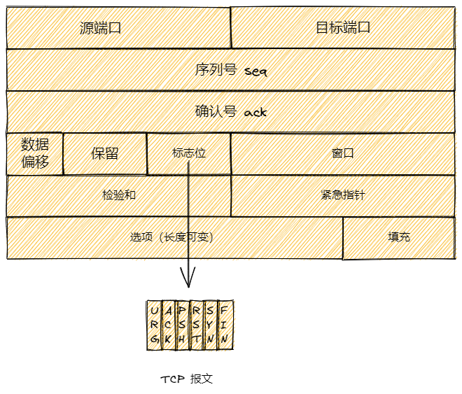

## Tcp报文格式

- 序列号 seq：4 字节，用来标识数据段的顺序，tcp 把连接中发送的所有数据字节都编上一个序号，第一个字节的编号由本地随机产生；给字节编上序号后，就给每一个报文指派一个序号；序列号 seq 就是这个报文段中的第一个字节的数据编号。

- 确认号 ack：4 字节，期待收到对方下一个报文段的第一个数据字节的序号；序列号表示报文段携带数据的第一个字节的编号；而确认号指的是期望接受到下一个字节的编号；因此当前报文段最后一个字节的编号 +1 即为确认号。

- 确认 ACK：1 位，仅当 ACK = 1 时，确认号字段才有效。ACK = 0 时，确认号无效。

- 同步 SYN：连接建立时用于同步序号。当 SYN = 1，ACK = 0 时表示：这是一个连接请求报文段。若统一连接，则在响应报文段中使得 SYN = 1，ACK = 1。因此，SYN = 1 表示这是一个连接请求，或连接接受报文。SYN 这个标志位只有在 Tcp 建立连接时才会被置为 1，握手完成后 SYN 标志位置为 0。

- 终止 FIN：用来释放一个连接。FIN = 1 表示：此报文段的发送方的数据已经发送完毕，并要求释放运输连接。

## 标志位

| 字段 | 含义                                                         |
| ---- | ------------------------------------------------------------ |
| URG  | 紧急指针是否有效。为 1，表示某一位需要被优先处理             |
| ACK  | 确认号是否有效，一般置为 1                                   |
| PSH  | 提示接收端应用程序立即从 Tcp 缓冲区把数据读走                |
| RST  | 对方要求重新建立连接，复位                                   |
| SYN  | 请求建立连接，并在其序列号的字段进行序列号的初始值设定，建立连接，设置为 1 |
| FIN  | 希望断开连接                                                 |

## 三次握手

- 第一次握手：建立连接时，客户端发送 SYN（SYN=j） 包到服务器，客户端并进入到 SYN-SENT 状态，等待服务器确认，SYN：同步序列编号；
- 第二次握手：服务器收到 SYN 包，确认客户端的 SYN（ack=j+1），同时自己也发送一个 SYN（SYN=k） 包作为响应，即 SYN + ACK 包，此时服务器进入到 SYN-RECV 状态；
- 第三次握手：客户端收到服务器的 SYN + ACK 包，向服务器发送确认包 ACK（ack=k+1），此包发送完毕，客户端和服务器进入 ESTAB-LISHED（Tcp 连接成功） 状态，完成三次握手。

## 四次挥手

- 客户端进程发出连接释放报文，并且停止发送数据。释放数据报文首部，FIN=1，其序列号为 seq=u（等于前面已经传送过来的数据的最后一个字节的序号+1），此时，客户端进入 FIN-WAIT-1（终止等待1）状态。Tcp 规定，FIN 报文段即使不携带数据，也要消耗一个序号。
- 服务端收到连接释放报文，发出确认报文，ACK=1，ack=u+1，并且带上自己的序列号 seq = v，此时服务端就进入了 CLOSE-WAIT（关闭等待）状态。Tcp 服务器通知高层的应用进程，客户端向服务端的方向就释放了，这时候处于半关闭状态，即客户端已经没有数据要发送了，但是服务器若发送数据，客户端依然要接受。这个状态还要持续一段时间，也就是整个CLOSE-WAIT状态持续的时间。
- 客户端收到服务器的确认请求后，此时，客户端就进入FIN-WAIT-2（终止等待2）状态，等待服务器发送连接释放报文（在这之前还需要接受服务器发送的最后的数据）。
- 服务器将最后的数据发送完毕后，就向客户端发送连接释放报文，FIN=1，ack=u+1，由于在半关闭状态，服务器很可能又发送了一些数据，假定此时的序列号为 seq=w，此时，服务器就进入了LAST-ACK（最后确认）状态，等待客户端的确认。
- 客户端收到服务器的连接释放报文后，必须发出确认，ACK=1，ack=w+1，而自己的序列号是seq=u+1，此时，客户端就进入了 TIME-WAIT（时间等待）状态。注意此时 TCP 连接还没有释放，必须经过 2∗MSL（最长报文段寿命）的时间后，当客户端撤销相应的进程后，才进入 CLOSED 状态。
- 服务器只要收到了客户端发出的确认，立即进入 CLOSED 状态。同样，撤销进程后，就结束了这次的 TCP 连接。可以看到，服务器结束 TCP 连接的时间要比客户端早一些。

## 为什么连接的时候是三次握手，关闭的时候却是四次？

因为当服务端接收到客户端的 SYN 连接报文后，可以直接发送 SYN + ACK 报文。其中 ACK 报文是用来应答的，SYN 是用来同步的。但是关闭连接时，当服务端接受到 FIN 报文时，服务端可能不会直接关闭 socket，所以只能先回复 ACK 报文，表示服务端已经收到客户端发起的关闭连接请求，直到服务端把所有报文都发送完毕之后，才发送 FIN 报文到客户端，因此服务端是不能将 FIN 和 ACK 报文一起发送给客户端的，故需要四次。

## 为什么不能用两次握手进行连接

三次握手完成了两个重要功能，一是让双方都知道并确认已经做好了接受和发送数据的准备工作，二是允许双方就初始化序列号进行协商，这个序列号在握手过程中被发送和确认（seq 和 ack）。

如果将三次握手改为两次握手，可能会发生死锁。举个例子：加入客户端发送给服务端一个 SYN 包，服务端收到该包，并发送了 SYN +ACK。按照两次握手的协定，服务端认为连接已经成功建立了，进入到 ESTAB-LISHED 状态。此时，客户端并没有收到服务端的 SYN + ACK（可能在传输过程中丢失）。在这种情况下，客户端认为连接未建立，将忽略服务端发送过来的任何数据，只等待连接确认应答。而服务端发出的报文超时后，重复发送同样的报文，这样就形成了死锁。

## 为什么 TIME-WAIT 状态需要经过 2MSL（最大报文段生存时间）才能返回到 CLOSE 状态？

按道理，四个报文都发送完毕后，我们可以直接进入到 CLOSE 状态了，但是我们必须假象网络是不可靠的，又可能最后一个 ACK 丢失了。所以 TIME_WAIT 状态就是用来重发可能丢失的 ACK 报文。在客户端发送出最后的 ACK 回复，但该 ACK 可能丢失。服务端如果没有收到 ACK，将不断重复发送 FIN 片段。所以客户端此时是不能立即关闭，它必须确认服务端接收到了该 ACK。客户端会在发送出 ACK 之后进入到 TIME_WAIT 状态。客户端会设置一个计时器，等待 2MSL 的时间。如果在该时间内再次收到 FIN，那么客户端会重发 ACK 并再次等待 2MSL。所谓的 2MSL 是两倍的 MSL(Maximum Segment Lifetime)。MSL 指一个片段在网络中最大的存活时间，2MSL 就是一个发送和一个回复所需的最大时间。如果直到2MSL，客户端都没有再次收到 FIN，那么客户端推断 ACK 已经被成功接收，则结束TCP连接。

## 如果已经建立了连接，但是客户端突然出现故障了怎么办？

Tcp 还没有一个保活计时器，显然，客户端如果出现故障，服务端不能一直等待下去。对于这种情况，在服务端会维护一个连接计时器，时间通常是 2 小时，服务端每收到一次客户端的请求后都会重新复位这个计时器，若两个小时还没有收到客户端的任何数据，服务端就会发送一个探测报文，往后每隔 75 秒发送一次，若一连发送 10 个探测报文仍然没有反应，服务器就认为客户端出了故障，接着就主动关闭连接。
