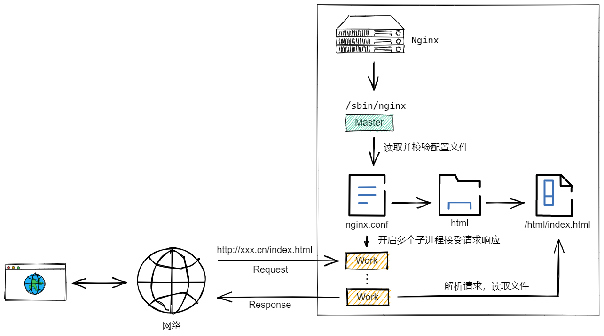

## Nginx 目录结构

- `conf`：存放 Nginx 核心配置相关文件，其中 `nginx.conf` 就是 Nginx 的主配置文件

- `html`：存放静态资源的默认目录，例如站点的静态资源（html、css，js）

- `logs`：存放 Nginx 的访问日志文件，记录用户访问的资源记录
  
  - `access.log`：记录 Nginx 的成功访问日志
  
  - `error.log`：记录 Nginx 的错误访问日志
  
  - `nginx.pid`：记录 Nginx 运行时的 PID（进程ID）

- `sbin`：存放 Nginx 主程序文件

- client_body_temp

- fastcgi_temp

- proxy_temp

- scgi_temp

- uwsgi_temp

其中 `client_body_temp、fastcgi_temp、proxy_temp、scgi_temp` 这些文件夹在刚安装完成时是没有的，它们用于存放 Nginx 运行过程中的临时文件。

## Nginx 运行原理

Nginx 启动时，会有一个 Master 进程（主进程），该进程会扫描 conf 文件夹下的配置文件，并校验配置。当配置校验通过之后，fork 出多个 Work 进程（子进程）处理和响应请求。Master 进程是不处理任何请求的，他负责管理 Nginx 的配置和 Work 进程，在启动时校验配置文件；配置文件刷新时，通知并结束 Work 进程。
