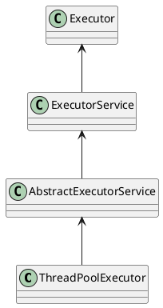

<!-- more -->


# 线程池

# 线程池



ThreadPoolExecutor 实现的顶层接口是 Executor，顶层接口 Executor 提供了一种思想：将任务提交和任务执行进行解耦。

用户无需关注如何创建线程，如何调度线程来执行任务，用户只需提供 Runnable 对象，将任务的运行逻辑提交到执行器(Executor)中，由 Executor 框架完成线程的调配和任务的执行部分。ExecutorService 接口增加了一些能力：

（1）扩充执行任务的能力，补充可以为一个或一批异步任务生成 Future 的方法；

（2）提供了管控线程池的方法，比如停止线程池的运行。

AbstractExecutorService 则是上层的抽象类，将执行任务的流程串联了起来，保证下层的实现只需关注一个执行任务的方法即可。最下层的实现类 ThreadPoolExecutor 实现最复杂的运行部分，ThreadPoolExecutor 将会一方面维护自身的生命周期，另一方面同时管理线程和任务，使两者良好的结合从而执行并行任务。


线程池在内部实际上构建了一个生产者消费者模型，将线程和任务两者解耦，并不直接关联，从而良好的缓冲任务，复用线程。

线程池的运行主要分成两部分：任务管理、线程管理。

任务管理部分充当生产者的角色，当任务提交后，线程池会判断该任务后续的流转：

（1）直接申请线程执行该任务；

（2）缓冲到队列中等待线程执行；

（3）拒绝该任务。

线程管理部分是消费者，它们被统一维护在线程池内，根据任务请求进行线程的分配，当线程执行完任务后则会继续获取新的任务去执行，最终当线程获取不到任务的时候，线程就会被回收。

## 生命周期管理

ThreadPoolExecutor 的运行状态有 5 种：


其生命周期转换如下入所示：

​

## 拒绝策略

- AbnortPolicy：抛出一个异常，默认的拒绝策略
- DiscardPolicy：直接丢弃任务
- DiscardOldestPolicy：丢弃队列中最老的任务，将当前这个任务继续提交给线程池
- CallerRunsPolicy：交给调用 execute 的线程处理（对调用者来说这个过程是同步执行的，并没有发生异步事件）

## 队列类型

- ArrayBlockingQueue：有界队列，是一个用数组实现的有界阻塞队列，按 FIFO 排序。
- LinkedBlockingQueue：基于链表实现的阻塞队列，按 FIFO 排序任务，容量可以设置，不设置的话将是一个无边界的阻塞队列（最大长度是 Integer.MAX_VALUE），吞吐量通常要高于 ArrayBlockingQueue；newFixedThreadPool 线程池使用的就是这个队列。
- DelayQueue：DelayQueue 是一个任务定时周期延迟执行的队列。根据指定的执行从小到大排序，否则根据插入到队列的先后排序。newScheduledThreadPool 线程池使用了这个队列。
- PriorityBlockingQueue：优先级队列是具有优先级的无界阻塞队列
- SynchronousQueue：同步队列，一个不存储元素的阻塞队列，每个插入操作都必须等待另一个线程调用移除操作，否则插入操作将一直处于阻塞状态。吞吐量通常要高于 LinkedBlockingQueue，newCachedThreadPool使用了这个队列

## 核心方法

### execute

任务调度是线程池的主要入口，当用户提交了一个任务，接下来这个任务将如何执行都是由这个阶段决定的。了解这部分就相当于了解了线程池的核心运行机制。

首先，所有任务的调度都是由 execute 方法完成的，这部分完成的工作是：检查现在线程池的运行状态、运行线程数、运行策略，决定接下来执行的流程，是直接申请线程执行，或是缓冲到队列中执行，亦或是直接拒绝该任务。其执行过程如下：

1. 首先检测线程池运行状态，如果不是 RUNNING，则直接拒绝，线程池要保证在 RUNNING 的状态下执行任务。
2. 如果 workerCount < corePoolSize，则创建并启动一个线程来执行新提交的任务。
3. 如果 workerCount >= corePoolSize，且线程池内的阻塞队列未满，则将任务添加到该阻塞队列中。
4. 如果 workerCount >= corePoolSize && workerCount < maximumPoolSize，且线程池内的阻塞队列已满，则创建并启动一个线程来执行新提交的任务。
5. 如果 workerCount >= maximumPoolSize，并且线程池内的阻塞队列已满, 则根据拒绝策略来处理该任务, 默认的处理方式是直接抛异常。

其执行流程如下图所示：

​

```java
public void execute(Runnable command) {
        if (command == null)
            throw new NullPointerException();
        /*
         * Proceed in 3 steps:
         *
         * 1. If fewer than corePoolSize threads are running, try to
         * start a new thread with the given command as its first
         * task.  The call to addWorker atomically checks runState and
         * workerCount, and so prevents false alarms that would add
         * threads when it shouldn't, by returning false.
         *
         * 2. If a task can be successfully queued, then we still need
         * to double-check whether we should have added a thread
         * (because existing ones died since last checking) or that
         * the pool shut down since entry into this method. So we
         * recheck state and if necessary roll back the enqueuing if
         * stopped, or start a new thread if there are none.
         *
         * 3. If we cannot queue task, then we try to add a new
         * thread.  If it fails, we know we are shut down or saturated
         * and so reject the task.
         */
        int c = ctl.get();
        // 当前工作线程数小于核心数时，使用核心线程执行任务
        if (workerCountOf(c) < corePoolSize) {
            if (addWorker(command, true))
                return;
            c = ctl.get();
        }
        // 将任务添加到队列
        if (isRunning(c) && workQueue.offer(command)) {
            int recheck = ctl.get();
            // 如果当前线程池不是 RUNNING 状态，则从队列中将任务移除，并拒绝该任务
            if (!isRunning(recheck) && remove(command))
                reject(command);
            // 当前线程池中没有工作线程时，创建一个非核心线程去执行队列任务
            else if (workerCountOf(recheck) == 0)
                addWorker(null, false);
        }
        // 将使用非核心线程执行任务
        else if (!addWorker(command, false))
            reject(command);
    }
```

### addWorker

```java
/**
 * firstTask：新线程创建后要执行的第一个任务，可能是提交的任务，也可能是 null（空闲等待队列任务）
 * core：标识新建的线程是否计入 corePoolSize（核心线程数）还是 maximumPoolSize（最大线程数）
 * 返回值：
 * 		true 表示成功启动了一个新线程；
 * 		false 表示没能启动新线程。
 */
private boolean addWorker(Runnable firstTask, boolean core) {
        retry:
        for (int c = ctl.get();;) {
            // Check if queue empty only if necessary.
			// 如果线程池状态 >= SHUTDOWN
    		// 并且满足以下任一条件：状态 >= STOP、firstTask 不为空、队列为空
		    // 那么不能再加线程，直接返回 false
            if (runStateAtLeast(c, SHUTDOWN) && (runStateAtLeast(c, STOP) || firstTask != null || workQueue.isEmpty()))
                return false;

            for (;;) {
				// 超过核心线程数或最大线程数限制
                if (workerCountOf(c) >= ((core ? corePoolSize : maximumPoolSize) & COUNT_MASK))
                    return false;
				// CAS 成功增加 workerCount，跳出 retry 外层循环
                if (compareAndIncrementWorkerCount(c))
                    break retry;
				
				// 重新读取 ctl
                c = ctl.get();
                if (runStateAtLeast(c, SHUTDOWN))
					// 状态变了，回外层循环重试
                    continue retry;
                // else CAS failed due to workerCount change; retry inner loop
				// 否则是 CAS 失败（竞争），继续内层循环重试
            }
        }

        boolean workerStarted = false;
        boolean workerAdded = false;
        Worker w = null;
        try {
			// 封装任务和线程
            w = new Worker(firstTask);
            final Thread t = w.thread;
            if (t != null) {
				// 加锁 mainLock 确保 workers 集合操作线程安全。
                final ReentrantLock mainLock = this.mainLock;
                mainLock.lock();
                try {
					// 持有锁时重新检查。
					// ThreadFactory 失败或在获取锁之前关闭时退出。
                    int c = ctl.get();
					
					// 如果线程池还在运行，或者处于 SHUTDOWN 且 firstTask == null
                    if (isRunning(c) || (runStateLessThan(c, STOP) && firstTask == null)) {
                        if (t.getState() != Thread.State.NEW)
                            throw new IllegalThreadStateException();
						
						// 把 Worker 加入到 workers 集合
                        workers.add(w);
                        workerAdded = true;
						
						// 更新 largestPoolSize（历史最大线程数）
                        int s = workers.size();
                        if (s > largestPoolSize)
                            largestPoolSize = s;
                    }
                } finally {
                    mainLock.unlock();
                }

				// 添加成功并启动线程
                if (workerAdded) {
					// 启动线程
                    container.start(t);
                    workerStarted = true;
                }
            }
        } finally {
            if (!workerStarted)
				 // 启动失败要回滚（减少计数，移除集合）
                addWorkerFailed(w);
        }
        return workerStarted;
    }
```

### runWorker(w)

```java
final void runWorker(Worker w) {
        Thread wt = Thread.currentThread();
        Runnable task = w.firstTask;
        w.firstTask = null;
        w.unlock(); // allow interrupts
        boolean completedAbruptly = true;
        try {
			// 读取任务
            while (task != null || (task = getTask()) != null) {
				// 加锁
                w.lock();
                // 如果池正在停止，则确保线程被中断；
				// 如果不是，则确保线程未被中断。这需要在第二种情况下重新检查以处理清除中断时 shutdownNow 竞争
                if ((runStateAtLeast(ctl.get(), STOP) || (Thread.interrupted() && runStateAtLeast(ctl.get(), STOP))) && !wt.isInterrupted())
					// 中断
                    wt.interrupt();
                try {
                    beforeExecute(wt, task);
                    try {
                        task.run();
                        afterExecute(task, null);
                    } catch (Throwable ex) {
                        afterExecute(task, ex);
                        throw ex;
                    }
                } finally {
                    task = null;
                    w.completedTasks++;
                    w.unlock();
                }
            }
            completedAbruptly = false;
        } finally {
			// 工作线程退出
            processWorkerExit(w, completedAbruptly);
        }
    }
```

​

## 脑图

<iframe sandbox="allow-forms allow-presentation allow-same-origin allow-scripts allow-modals allow-popups" src="https://kodbox.hetengyue.site/#s/_3m1nlEA" data-src="" border="0" frameborder="no" framespacing="0" allowfullscreen="true" style="width: 2023px; height: 766px;"></iframe>

‍
